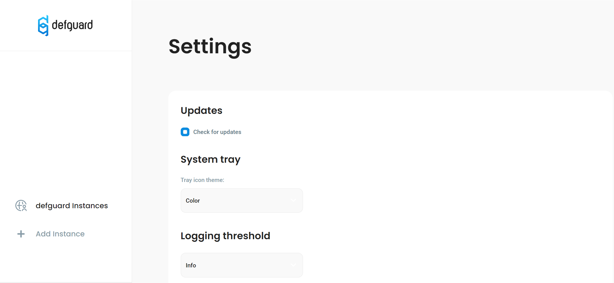
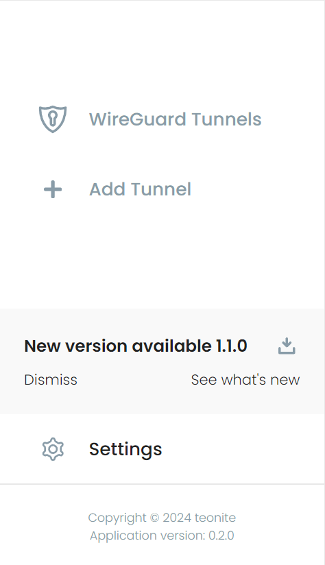

# Desktop Client

## Overview

Desktop client provides an easy way to access VPN locations of multiple Defguard instances via user-friendly UI.

Download latest release here: [https://defguard.net/download/](https://defguard.net/download/)

For development/pre-releases, go to GitHub: [https://github.com/DefGuard/client/releases](https://github.com/DefGuard/client/releases)


## Windows

Our desktop client has **bundled** official WireGuard client - as we use **wg.exe** to manage the WireGuard tunnels.


If you have the official WireGuard client installed - Defguard client installation may fail.


## MacOS

Has no external requirements and we have wireguard-go bundled.

## Linux


On Linux the desktop client uses `resolvconf` to manage DNS servers. On newer distributions it should be a symbolic link to `resolvectl`, more details can be found on the [troubleshooting](../broken-reference/) page.


### Ubuntu

#### Ubuntu 24

The libwebkit2gtk-4.0 library which our client depends on is not available in the default apt package repositories on Ubuntu 24.04 (there is only libwebkit2gtk-4.1 which doesn't work with current client). Client installation is still possible, but requires using some workarounds:

To safely install a package from Ubuntu Jammy repositories without breaking your system:

1. **Add Jammy Repo:**
   *   Open `/etc/apt/sources.list`:

       ```bash
       sudo nano /etc/apt/sources.list
       ```
   *   Add the Jammy repository with `[arch=amd64]` for your architecture:

       ```
       deb [arch=amd64] http://archive.ubuntu.com/ubuntu/ jammy main universe
       ```
   * Save and exit.
2. **Pin the Jammy Repo with low priority:**
   *   Create `/etc/apt/preferences.d/jammy.pref`:

       ```bash
       sudo nano /etc/apt/preferences.d/jammy.pref
       ```
   *   Add the following:

       ```
       Package: *
       Pin: release n=jammy
       Pin-Priority: -10
       ```
   * Save and exit.
3.  **Install the Specific Package:**

    ```bash
    sudo apt update
    sudo apt install -t jammy libwebkit2gtk-4.0
    ```
4. **Optionally: Remove Jammy Repo After Use:**\
   Delete or comment out the Jammy entry in `/etc/apt/sources.list`.

#### ArchLinux

There is an [AUR package](https://aur.archlinux.org/packages/defguard-client)[: defguard-client](https://aur.archlinux.org/packages/defguard-client).

If you don't know how to install AUR packages, please follow these guidelines:

* Manual install: [https://wiki.archlinux.org/title/Arch\_User\_Repository](https://wiki.archlinux.org/title/Arch_User_Repository)
* Installation through PARU (AUR Helper): [https://owlhowto.com/how-to-install-paru-on-arch-linux/](https://owlhowto.com/how-to-install-paru-on-arch-linux/)

## Client update

Defguard Client regularly checks for updates and in order to do so operating system name and installed application version are sent to the Defguard update service.

This functionality can be turned off in the Client settings under Updates section so that no data is sent.

<figure><figcaption><p>"Check for updates" setting</p></figcaption></figure>

If a new version is available, a notification with a download button will be shown near the bottom of the menu.

<figure><figcaption><p>New Desktop Client version available for download</p></figcaption></figure>
