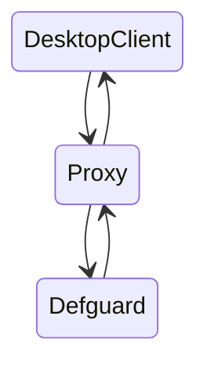

# Architecture

## Communication with Defguard

Client uses the [proxy ](https://github.com/DefGuard/proxy)to bridge communication between itself and Defguard.&#x20;

Temporary access to proxy endpoints is granted via token authorization.


Token lifespan can be configured via environment variables. You can learn more in[#enrollment-configuration](../../features/setting-up-your-instance/configuration.md#enrollment-configuration "mention")

