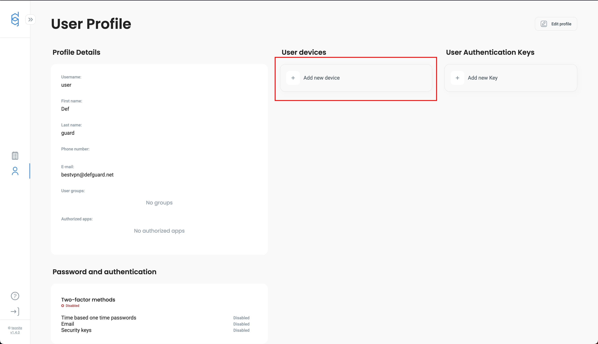
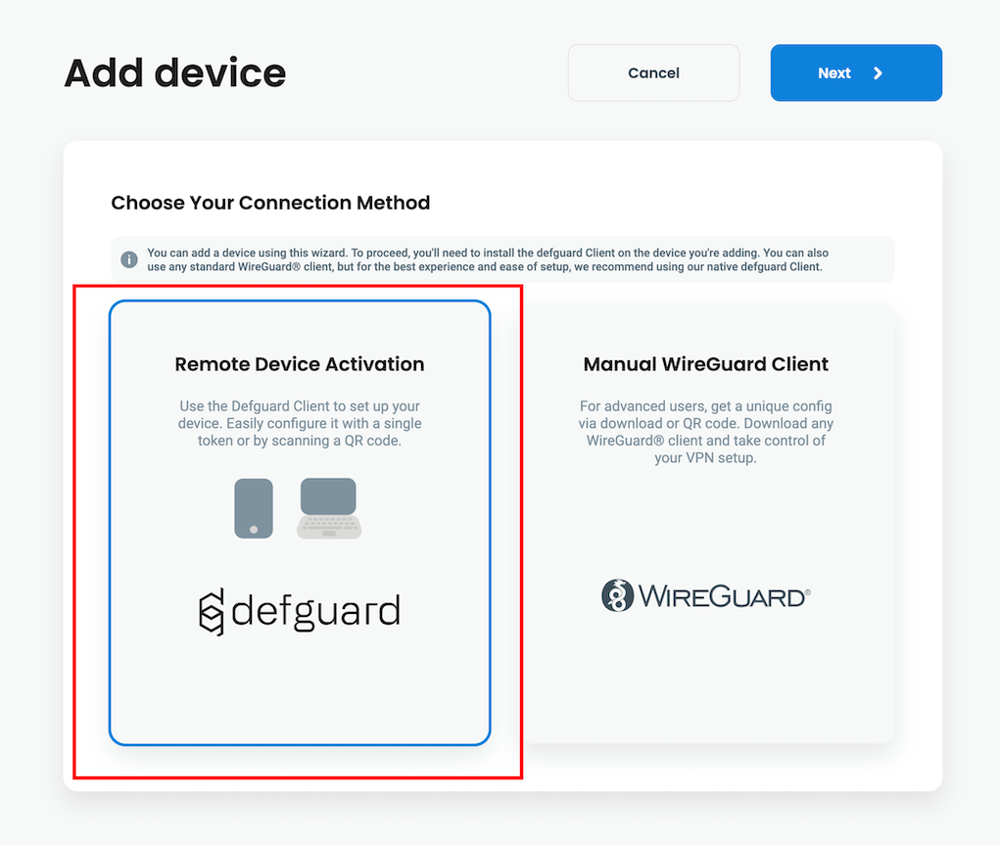
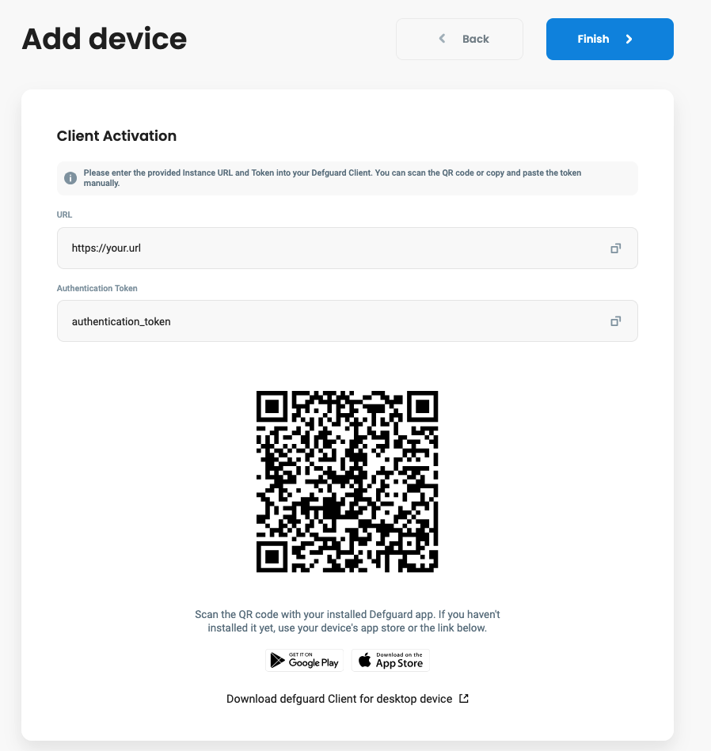
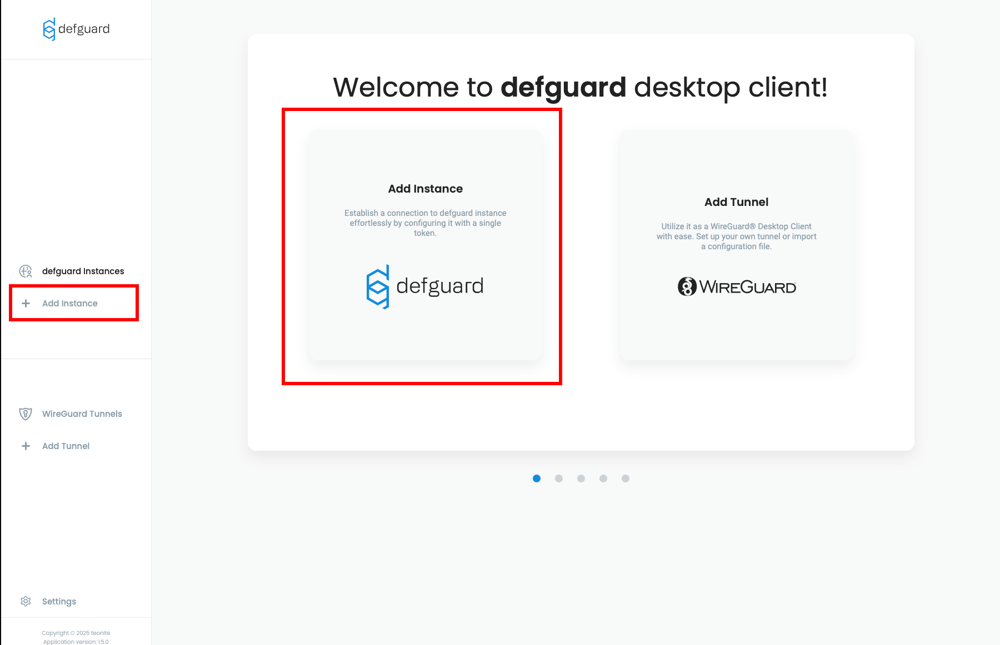
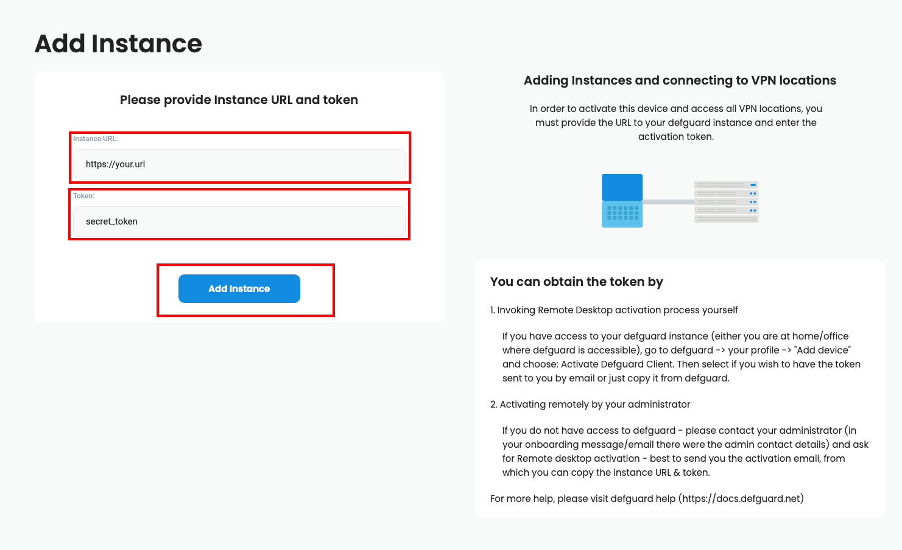
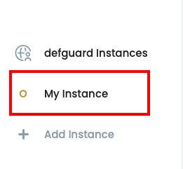
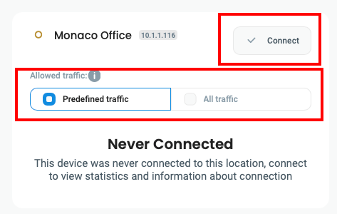
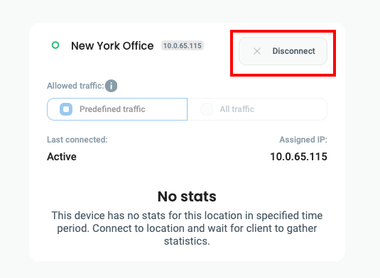
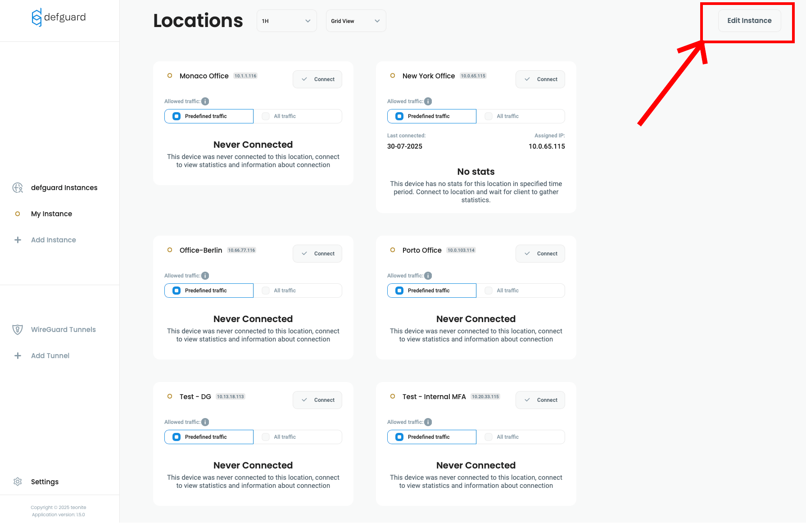
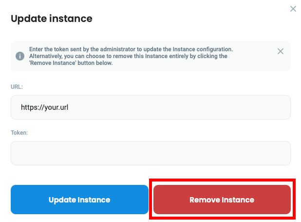

# Instance configuration


Defguard Desktop Client is required if you want to use Multi-Factor Authentication, as any other WireGuard client doesn't support this functionality.


### Obtaining URL and Token


If you are looking for how to generate tokens for your users as an Administrator, look here:

[remote-desktop-activation.md](../../admin-and-features/wireguard/remote-desktop-activation.md "mention")


1. Log in to your Defguard account.
2. Go to **My Profile** tab.
3. Click **Add new device** button inside **User Devices** list.

<figure><figcaption></figcaption></figure>

4. Select **Remote Device Activation** and click **Next**.

<figure><figcaption></figcaption></figure>

5. After that you will see URL, Token and QR Code. **Copy URL and Token.**

<figure><figcaption></figcaption></figure>

### Adding Instance

1. Open Defguard client
2. Click **Add Instance**.

<figure><figcaption></figcaption></figure>

3. Enter URL and Token, then click **Add Instance**. (If you don't have it, check out [this section](instance-configuration.md#obtaining-url-and-token))

<figure><figcaption></figcaption></figure>

### Connecting to Instance

1. Select your Instance from menu

<figure><figcaption></figcaption></figure>

2. Select your location, allowed traffic then click **Connect.**


* **Predefined traffic** will only route traffic specified by your administrator.
* **All traffic** will route everything through VPN tunnel.


<figure><figcaption></figcaption></figure>

### Disconnecting from Instance

Click **Disconnect** next to the location you are currently connected to.

<figure><figcaption></figcaption></figure>

### Updating Instance

If you want to update your instance manually:

1. Go to your Instance and click **Edit Instance**

<figure><figcaption></figcaption></figure>


Only tokens issued from that specific instance will work in that modal.


2. Enter Token provided by your administrator, or generate it [on your own](instance-configuration.md#obtaining-url-and-token). Then click **Update Instance**

<figure><figcaption></figcaption></figure>

Your Instance will update immediately.

### Why do instances need updates?

Defguard Desktop stores all information locally and doesn't communicate with Defguard outside the registration process. This means that information about instances are snapshots of the moment you registered them in the desktop client, and you might want to update that, for example when some new locations are added or removed.


If you have an Enterprise License, all desktop clients and all instances are [synchronized automatically and in real-time.](../../admin-and-features/remote-user-enrollment/automatic-real-time-desktop-client-configuration.md)


### Removing Instance

1. Go to your Instance and click **Edit Instance**

<figure><figcaption></figcaption></figure>

2. Click **Remove Instance**

<figure><figcaption></figcaption></figure>

Your Instance will be removed immediately.

