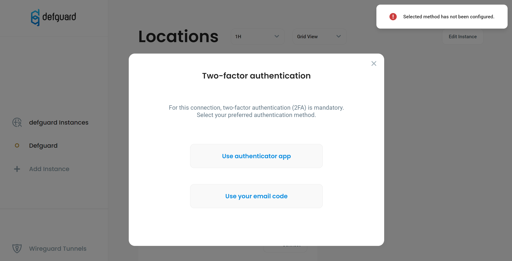

# Multi-Factor Authentication (MFA/2FA)

Defguard supports Multi-Factor Authentication for WireGuard with TOTP & Email codes and after that with **session keys based on Wireguard Pre-Shared Keys** (PSK). For more details about this please refer to the [architecture section](architecture.md).


MFA requires:

* defguard core >= v0.9.0
* defguard proxy >= v0.3.0
* desktop client >= 0.2.0


### Enabling MFA for a selected VPN/Location

It can be enabled for a desired VPN by going to **VPN Overview**, selecting the VPN from the dropdown list, and pressing the **Edit Location** button in the top right corner of the page. Next, check the "**Require MFA for this Location**" checkbox under the Location Configuration section and **save changes**.

<figure><figcaption>
Checkbox enabling MFA for selected VPN/Location
</figcaption></figure>


When MFA configuration is changed, all clients must do an [Instance Update](update-instance.md).


If a VPN has MFA enabled before connecting you will be asked to complete the authentication step first:

&#x20;

### Supported MFA methods

For now, MFA is only available for:

* TOTP - Time-based one-time password
* Email - requires [SMTP to be configured](../setting-up-smtp-for-email-notifications.md)

### User MFA setup

After enabling MFA for a given VPN, users will need to enable MFA for their accounts to be able to connect. This process is described in [setting-up-2fa-mfa.md](../setting-up-2fa-mfa.md "mention"). For simplicity & security, the desktop client uses the same MFA methods as the defguard server.

An error message will be shown if users attempt to select a MFA method that has not been enabled for their accounts:

<figure><figcaption>
Attempting to use an MFA method that has not been enabled on the user's account.
</figcaption></figure>

### Successful authentication

If authentication succeeds, the Two-factor authentication modal will be closed and connection to the selected VPN will be attempted. Users will be asked to authenticate on every connection to a VPN with MFA enabled.
