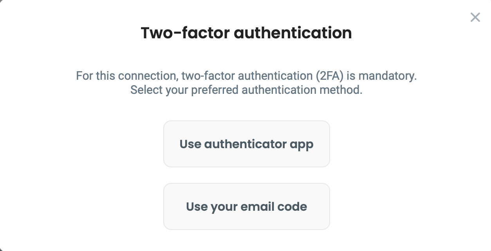

# Using Multi-Factor Authentication (MFA)


Connecting to location with required **external** MFA is possible in the desktop client since **version 1.5.0.** Please check out [**https://github.com/DefGuard/client/releases**](https://github.com/DefGuard/client/releases) for new releases.


* Up to version 1.4, only internal MFA was supported, user could only use MFA methods configured in his profile.
* Since version 1.5 (currently in alpha), MFA can be configured per location, and administrators can choose whether a location will use internal MFA or external OIDC/SSO provider.

Depending on location settings, you may use:

* Internal MFA - You must have at least one MFA method configured in your profile. For a detailed tutorial, [check out this article](../setting-up-2fa-mfa.md).
* External MFA - You will be redirected to an external site, where authentication is handled by your OIDC provider, for example Google/Microsoft.

## External MFA

1. Open Defguard client, select your Instance and click **Connect** next to location with required MFA

<figure><figcaption></figcaption></figure>

2. After clicking **Authenticate with Google,** you will be redirected to a secure site where you will need to log in in order to confirm your identity. In this example, we use Google as our OpenID provider, but yours can be different (Microsoft, Okta, etc.)

<figure><figcaption></figcaption></figure>

3. After logging in, you will see this

<figure><figcaption></figcaption></figure>

Your connection will be established immediately after successful authentication.

## Internal MFA

1. Open Defguard client, select your Instance and click **Connect** next to location with required MFA

<figure><figcaption></figcaption></figure>

2. Choose method configured for your account, and click **Connect**.
   * If you're using "Email" method, please enter the code sent to your email.
   * If you're using "Authenticator App", please enter code generated within your authenticator app.


If you don't know how to setup or use your **Authenticator App** please check [this article](../setting-up-2fa-mfa.md#setting-up-2famfa) for detailed information.


<figure><figcaption></figcaption></figure>

3. After entering code, click **Verify**

<figure><figcaption></figcaption></figure>

Your connection will be established immediately after this step.
