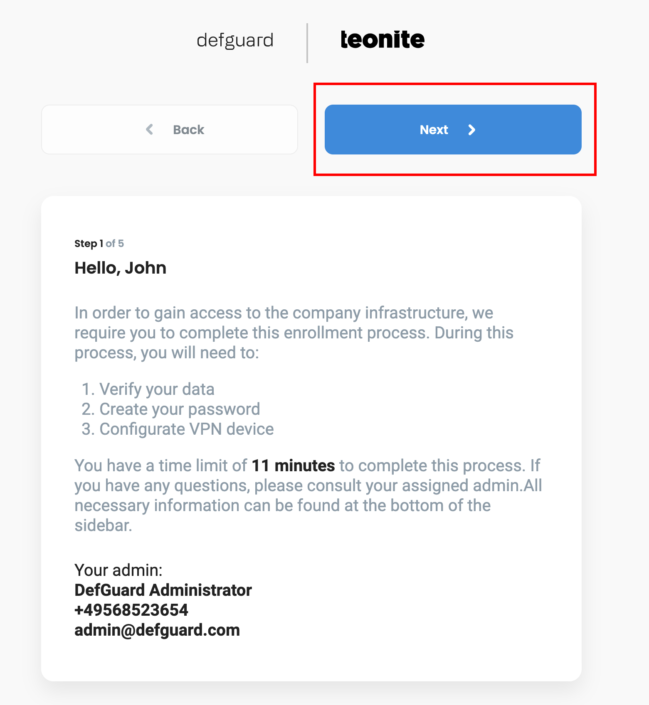
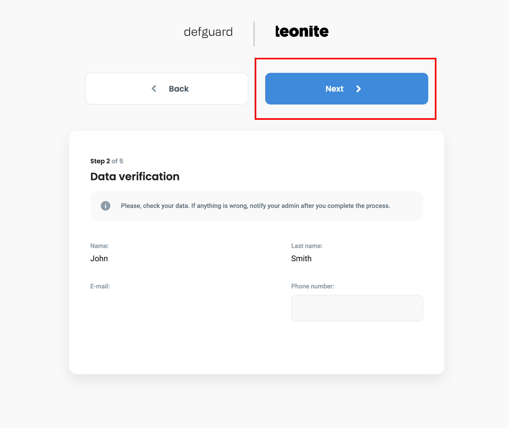
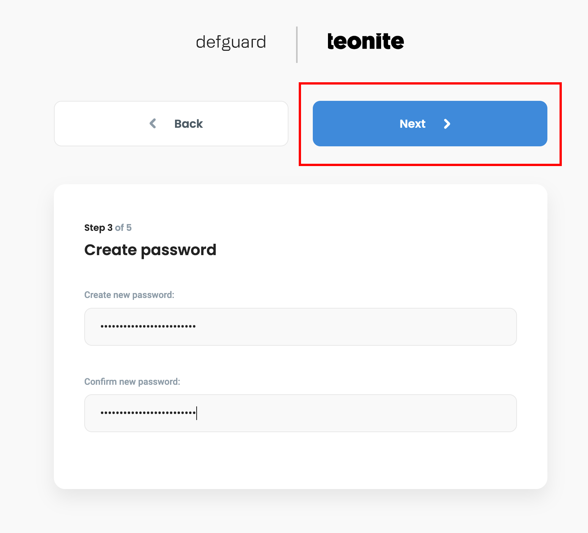
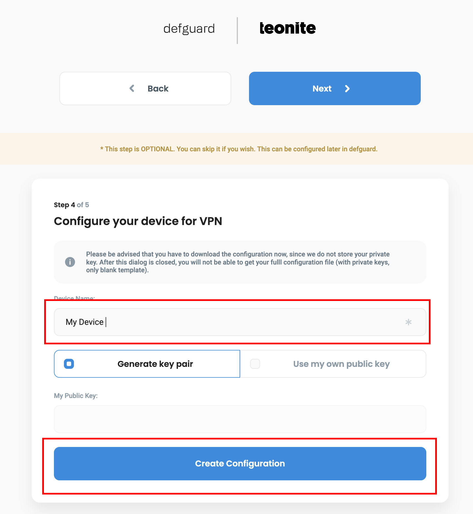
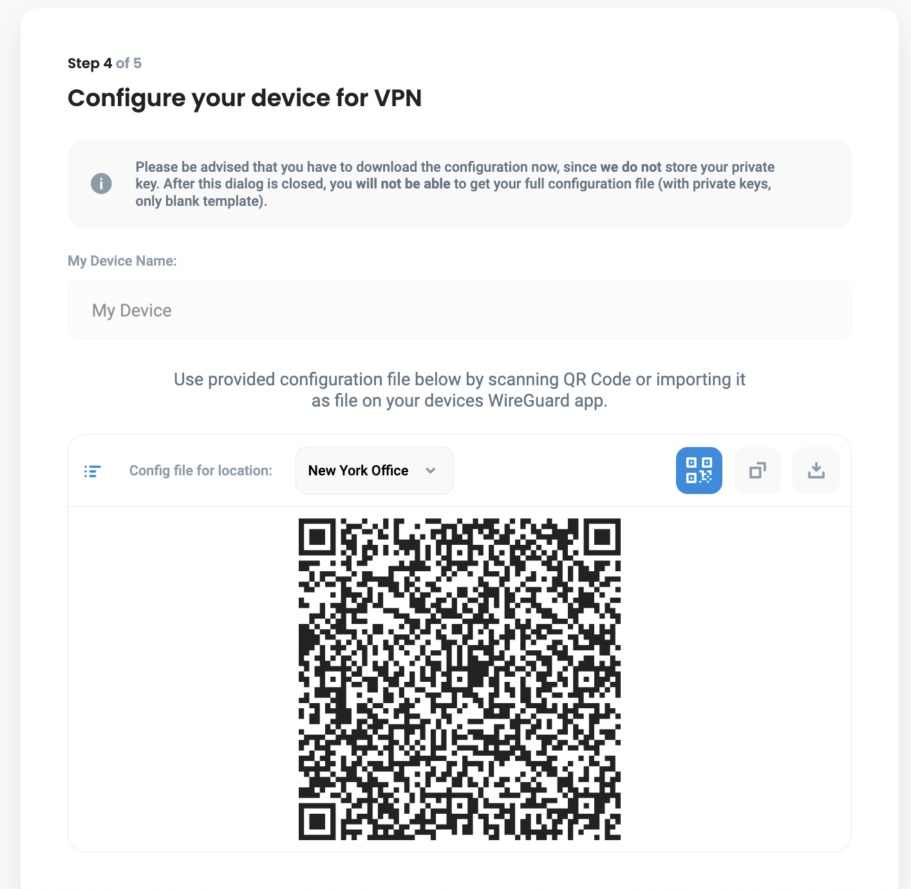
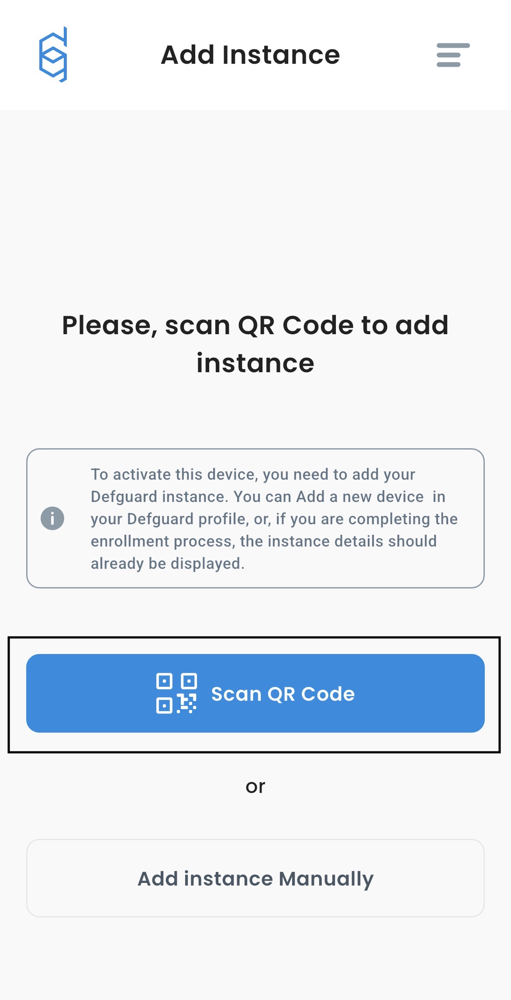
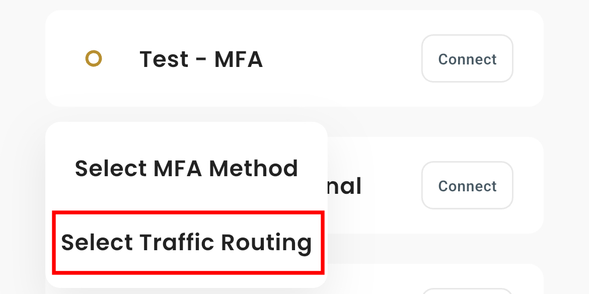
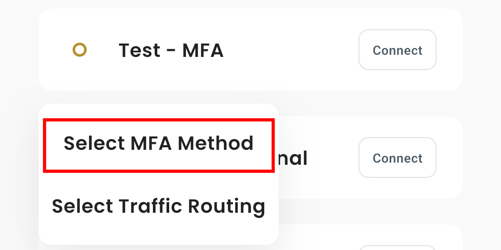
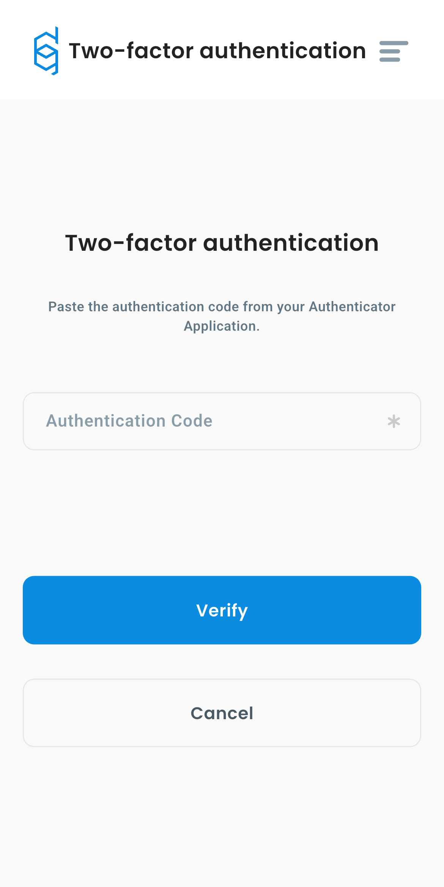

# Mobile Client


Mobile client is currently under development **(closed beta)**, current page should be considered as preview. Some parts of UI may look different in upcoming release.


### Overview

This guide explains how to use the Defguard Mobile to connect securely to VPN locations managed within your Defguard [instance](mobile-client.md#what-is-an-instance). It covers the entire process, from installation, adding new instances, connecting to locations, to managing your VPN connection settings.

### Installation
1. Join closed beta for [iOS](https://defguard.net) or [Android](https://defguard.net). (Coming soon!)
2. Download and install the app on your device.

## Adding new instance

### Adding Instance during the enrollment process


After receiving an email with a URL, you can not only set up your account but also add your mobile device. Please ensure that you already have Defguard Mobile installed on your device.


1. After going to the enrollment page, you should see something like this:
**Before proceeding, read the text carefully, as it may contain important information given by your administrator,** then click **Next**.
<figure></figure>

2. In this step you can optionally enter your phone number after entering it. Proceed by clicking the **Next** button.
<figure></figure>

3. Now, you need to set up your password. After entering the password, proceed by clicking **Next**.
<figure></figure>

4. This is the step where we can add our mobile device. Enter the name of your device, then click **Create Configuration**. 
<figure></figure>

5. You should see a screen like this. 
<figure></figure>

6. Open Defguard on your mobile device. Click **Scan QR Code**, and scan the code from **step 5**.
<figure></figure>

7. After scanning the QR code, enter name of your device and confirm.

**If you want to connect to your Defguard Instance, please proceed to [this section](#connecting-to-instance)**

### Adding Instance in Defguard

1. Log in to your Defguard account.
2. Go to **My Profile** tab.
3. Click **Add new device** button inside **User Devices** list.
<figure><figcaption></figcaption></figure>

4. Select **Remote Device Activation** and click **Next**. 
<figure><figcaption></figcaption></figure>

5. After that you should see URL, Token and QR Code. **Take screenshot of QR code**, we will need it in next step.
<figure><figcaption></figcaption></figure>

6. Open Defguard Mobile on your smartphone
7. Click **Scan QR Code**
<figure></figure>

8. Scan QR generated in step 5.
9. Enter name of your device. For example "iPhone 11"
10. Confirm


If you can't scan QR Code, select **Add Instance Manually** in **step 4** and enter URL and Token from **step 5**.



Your phone will need to add new VPN configuration, you will see popup like this:
<figure></figure>

Please click **Allow**, without this permission, Defguard cannot establish VPN connection.


## Connection management

### Connecting for the first time
 

Some VPN locations require extra security when connecting. This is called MFA (Multi-Factor Authentication). There are two types:

* Internal MFA: You confirm your identity directly in the app, for example by entering a code from your Authenticator App or email.
* External MFA: You are redirected to a secure login page (like Google or Microsoft) outside the app to confirm your identity.

If your location uses MFA, please scroll down to this [section](#connecting-to-location-with-mfa) 


1. Open Defguard
2. Click on Instance you want to connect to.
<figure><figcaption></figcaption></figure>

3. Click **"Connect"** next to location you want to use.
<figure><figcaption></figcaption></figure>


The first time you connect, app will ask whether you want to route **predefined traffic** or **all traffic**. You should see screen like this:

<figure></figure>

* **Predefined traffic** is optimized for general browsing and will route only specific traffic through VPN.
* **All traffic** provides full encryption and privacy for all your device traffic.

You can select **Remember my choice** if you don't want to be asked again.

If you want to change your traffic routing method after your first connection go to [this section](#changing-mfa-method-after-first-connection)



4. Choose your routing method
5. Confirm

If your location does not use MFA, your VPN connection should be established immediately after confirming your routing method.



If your location is using MFA please go to [section 3.2 "Connecting to location with MFA](#connecting-to-location-with-mfa)


After this step, whether your location require MFA, proceed to "[Connecting to location with MFA](#connecting-to-location-with-mfa)" or "[Connecting to location without MFA](#connecting-to-location-without-mfa)"

### Connecting to location with MFA

1. Open Defguard
2. Go to **Instances** and click **Connect** next to location you want to use.
<figure></figure>


If the VPN location requires OpenID for authentication (external MFA) you should see screen like this:
<figure><figcaption></figcaption></figure>

Click **Authenticate with OpenID** and you will be redirected to a secure login page (for example Google). Follow the instructions on the screen to log in. After successful authentication please return to Defguard. 
In the app you should see screen like this:

<figure><figcaption></figcaption></figure>

Now, your connection is successfully established.




When connecting with MFA for the first time, you will have the option to select **Remember my choice**. Select this option if you want to always use this method for this location.


3. After selecting routing method, you should see this:
<figure></figure>

4. Choose method configured for your account, and click **Connect**.
    - If you're using "Email" method, please enter code sent to your email.
    - If you're using "Authenticator App", please enter code generated within your authenticator app. 

If you don't know how to setup or use your **Authenticator App** please check [this article](/help/setting-up-2fa-mfa.md#setting-up-2famfa) for detailed information.

5. After this step, your connection will be established immediately.

### Connecting to location without MFA

1. Open Defguard
2. Go to **Instances** and click **Connect** next to location you want to use.
<figure></figure>
3. After this step your connection should be established.

### Disconnecting from VPN

To disconnect from a VPN location in Defguard:

1. Open  Defguard.
2. Go to the active instance
3. Click **Disconnect** button next to the location you are currently connected to.
<figure></figure>

After disconnecting, your device will stop sending traffic through the VPN and return to your regular internet connection.


## Managing your instance

### Changing traffic routing method after first connection

1. Open the Defguard.
2. Go to **Instances** in the app menu.
3. Press & Hold the **Connect** button next to the location you want to update.
4. When the popup appears, look for the option **Select Traffic Routing**.
<figure></figure>

5. You should see this:
<figure></figure>

6. Choose method and click **Connect** 

### Changing MFA method after first connection

1. Go to **Instances** in the app menu.
2. Press & Hold **Connect** button next to location name and wait until popup shows.

<figure><figcaption></figcaption></figure>

3. Click **Select MFA Method**.
4. You should see this:
<figure></figure>

5. Choose method and click **Connect** 

## Additional information

### Authenticating with Authenticator App (TOTP)

When connecting to a location that requires **internal** MFA, you should see this screen.

<figure><figcaption></figcaption></figure>

1. Open your Authenticator App (such as Google Authenticator or Microsoft Authenticator) on your phone.
2. Find the code generated for your Defguard account.
3. Enter this code into the Defguard.
4. Tap **Verify**.
