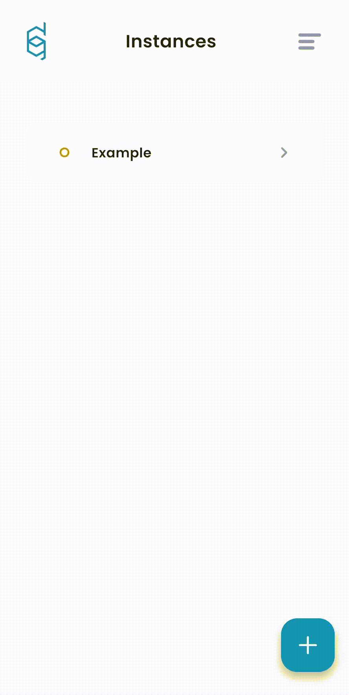
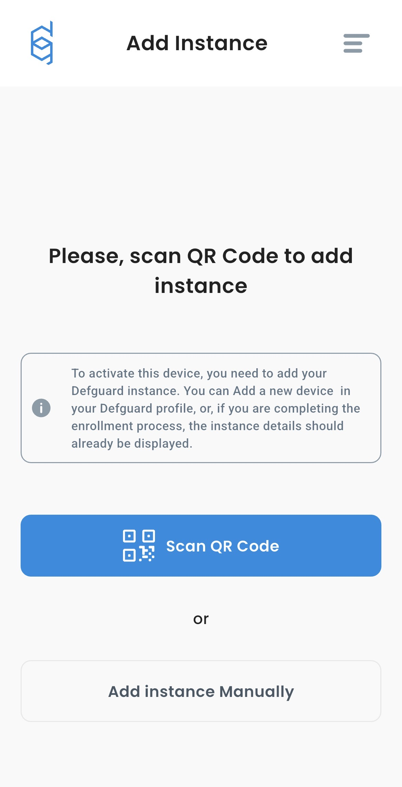
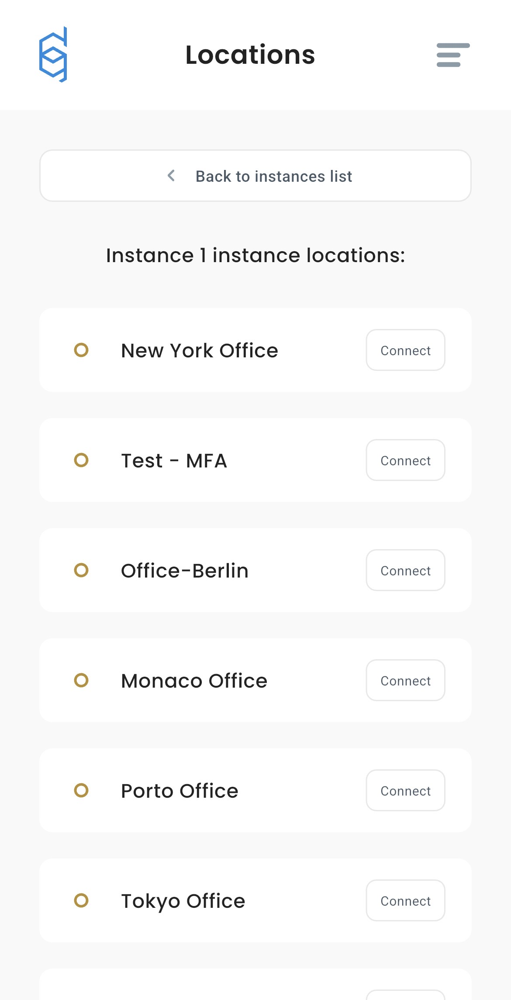

# Mobile Client

Mobile client is currently under development, current page should be considered as preview. Some parts of UI may look diffrent in upcoming release.


### Overview
This guide explains how to use the Defguard Mobile to connect securely to VPN locations managed within your Defguard instance. It covers the entire process, from installation, adding new instances, connecting to locations, to managing your VPN connection settings.

### Installation

Download for [iOS](https://defguard.net) or [Android](https://defguard.net) (Coming soon!)

### Quick guide
- [How to add instance?](#adding-new-instance-by-qr-or-manually)
- [How to connect to location without MFA?](#connecting-to-location-without-mfa)
- [How to connect to location with MFA?](#connecting-to-location-with-mfa)
- [How can I obtain QR Code?](#how-can-i-obtain-qr-code-url-and-token)
- [What is an instance?](#what-is-an-instance)
- [Supported MFA methods](#supported-mfa-methods)
- [Additional features](#additional-features)
### Connecting made effortless 

<figure></figure>

### Adding new instance

<figure></figure>


**Before** proceeding, please read [this](#how-can-i-obtain-qr-code-url-and-token) 


#### Add instance by QR Code
1. Go to "Add Instance" tab
2. Click "Scan QR Code"
3. Scan QR code
4. Enter name

#### Add instance manually
1. Go to "Add Instance" tab
2. Click "Add Instance Manually"
3. Enter URL and token
4. Confirm


Your phone will need to add new VPN configuration, when you see the request, please allow it. Without this permission, Defguard cannot establish VPN connection. 

### Connecting to location (without MFA)

1. Choose desired instance from list
2. Select location by clicking "Connect" next to it
3. Choose if you want to route you traffic with:
    - Predefined traffic (Faster for general browsing)
    - All traffic (Full encryption and privacy)
4. Press "Connect"

### Connecting to location (with MFA)

1. Choose desired instance from list
2. Select location by clicking "Connect" next to it
3. Choose if you want to route you traffic with:
    - Predefined traffic (Faster for general browsing)
    - All traffic (Full encryption and privacy)
4. Choose MFA method which is configured in your account
    - Email
    - Authenticator App
5. Authenticate and connect.


If your instance have configured external OpenID authentication, it will be used as primary method for MFA


### How can I obtain QR Code, URL and token?
1. Login to your Defguard instance
2. Go to "My Profile" tab
3. Click "Add new device" in "User devices" tab
<figure></figure>
4. Select "Remote Device Activation" and click "Next"
<figure></figure>
5. You will see URL, Authentication token and **QR Code**
<figure></figure>

### What is an instance?
An instance contains locations. These are the servers you can connect to via VPN. When you use the Defguard Mobile, you select an instance first, and then choose the specific location within it to establish your VPN connection.

#### Instance list
<figure></figure>

#### Location list (inside instance)
<figure></figure>

### Supported MFA Methods
Defguard Mobile supports multiple secure authentication methods:
- **TOTP** – time‑based one‑time passwords (Authenticator apps)  
- **Email** – receive verification codes via email  
- **OpenID** – integrate with any OpenID Connect provider (Google, etc.)

## Additional features
- Switch to **dark/light theme** — adapts to your system settings  
- View **live connection stats**, logs & tunnel details  
- Manage multiple instances
- Choose if you want to route all or predefined traffic