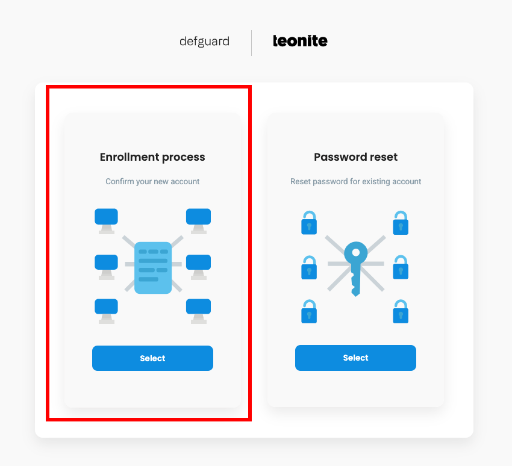
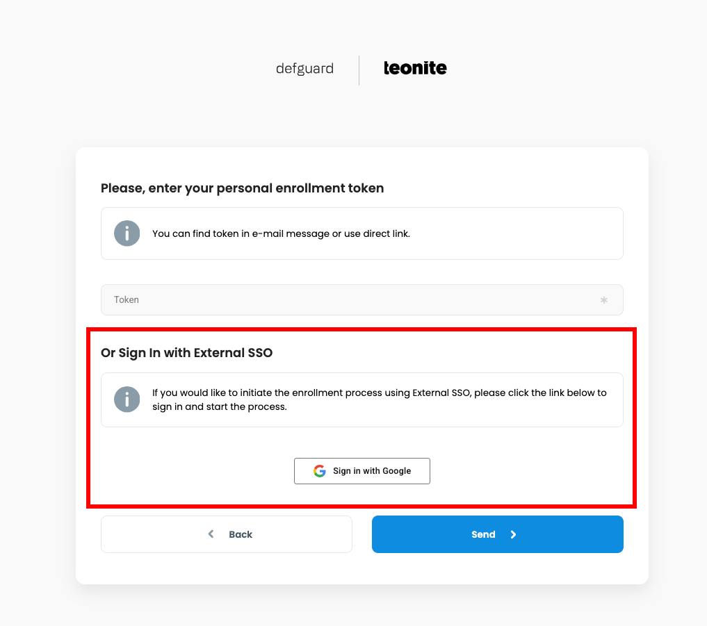
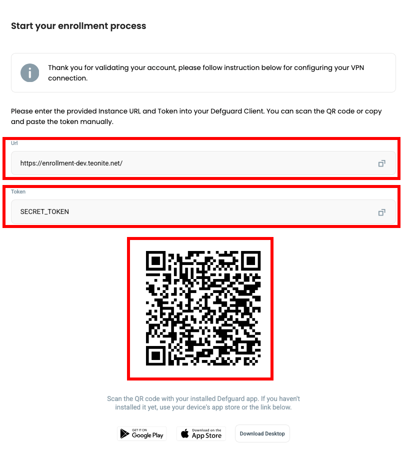
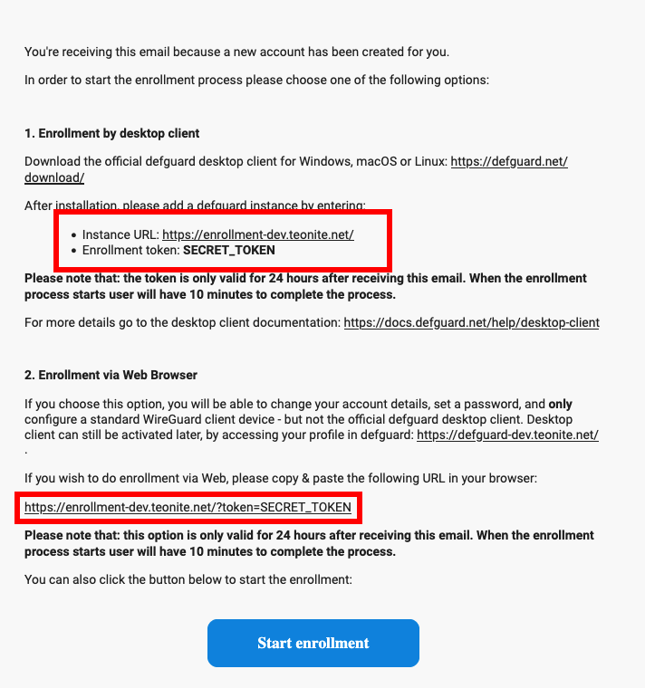
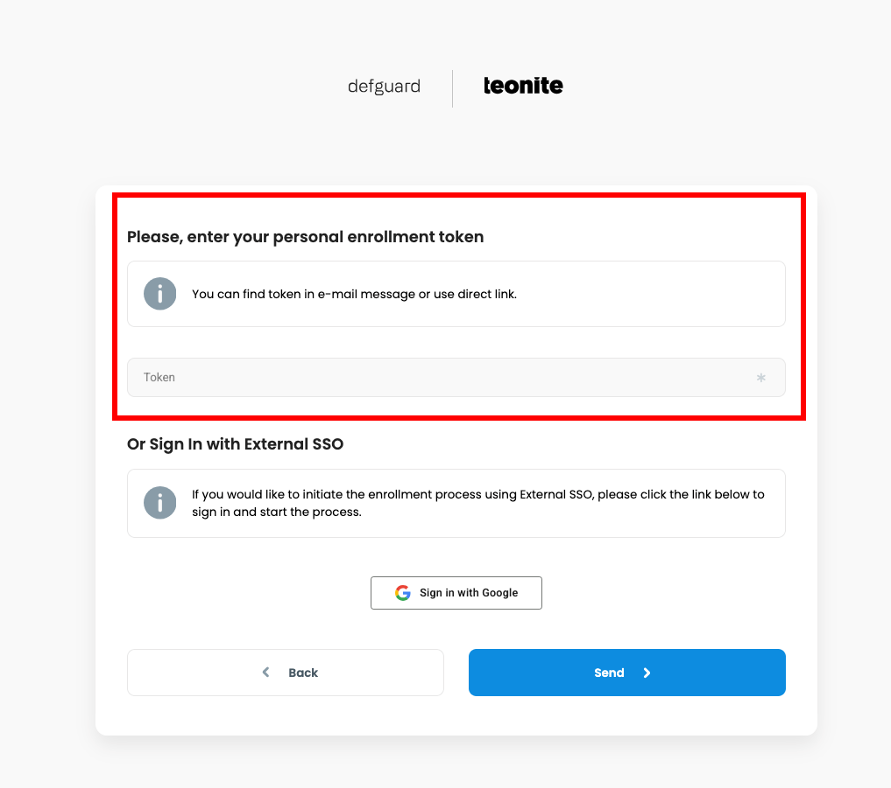

## Adding instance during the enrollment

### Enrollment via external SSO

1. Go to your enrollment page. Click **Select** under "Enrollment process".
<figure></figure>

2. In this example we use Google as OIDC provider so our button is "Sign in with Google". Your organization can use different OIDC provider.
<figure></figure>

3. You will be redirected to your OIDC provider login page, please log in. After doing this, you will be redirected and shown a screen with **URL, Token and QR Code**.
<figure></figure>

4. Open Defguard Mobile on your smartphone
5. Click **Scan QR Code**
<figure></figure>

6. Scan QR generated in step 3.
7. Enter the name of your device. For example "iPhone 11"
8. Confirm


If you can't scan QR Code, select **Add Instance Manually** in **step 5** and enter URL and Token from **step 3**.


### Enrollment via Email
Find enrollment **Instance URL** and **Token** in your "Defguard user enrollment" email. It should look like this:
<figure></figure>

If you want to enroll via Web Browser, click **Start enrollment** or:
1. Go to your enrollment page. Click **Select** under "Enrollment process".
<figure></figure>

2. Enter your **Token** and click **Send**.
<figure></figure>

Now, follow [Enrollment via Web Browser](#enrollment-via-web-browser) guide.

### Enrollment via Web Browser

1. Upon starting enrollment process you will see something like this:
**Before proceeding, read the text carefully, as it may contain important information given by your administrator,** then click **Next**.
<figure></figure>

2. In this step you can optionally enter your phone number after entering it. Proceed by clicking the **Next** button.
<figure></figure>

3. Now, you need to set up your password. After entering the password, proceed by clicking **Next**.
<figure></figure>

4. This is the step where we can add our mobile device. Enter the name of your device, then click **Create Configuration**. 
<figure></figure>

5. You will see a screen like this. 
<figure></figure>

6. Open Defguard on your mobile device. Click **Scan QR Code**, and scan the code from **step 5**.
<figure></figure>

7. After scanning the QR code, enter the name of your device and confirm.


If you can't scan QR Code, select **Add Instance Manually** in **step 6** and enter URL and Token from **step 5**.


### Adding Instance in Defguard

1. Log in to your Defguard account.
2. Go to **My Profile** tab.
3. Click **Add new device** button inside **User Devices** list.
<figure><figcaption></figcaption></figure>

4. Select **Remote Device Activation** and click **Next**. 
<figure><figcaption></figcaption></figure>

5. After that you will see URL, Token and QR Code. **Take a screenshot of QR code**, we will need it in next step.
<figure><figcaption></figcaption></figure>

6. Open Defguard Mobile on your smartphone
7. Click **Scan QR Code**
<figure></figure>

8. Scan QR generated in step 5.
9. Enter the name of your device. For example "iPhone 11"
10. Confirm


If you can't scan QR Code, select **Add Instance Manually** in **step 4** and enter URL and Token from **step 5**.

