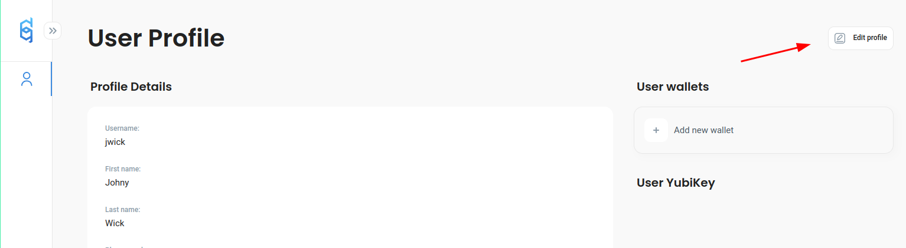
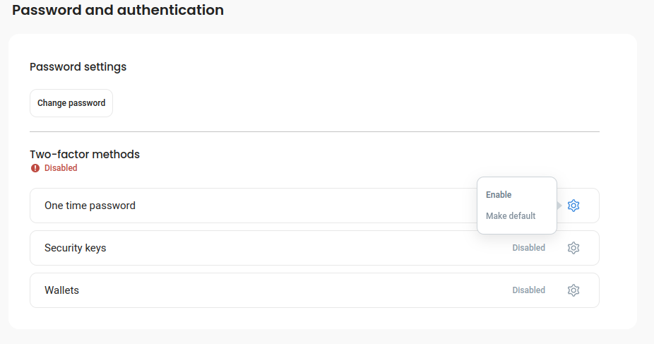
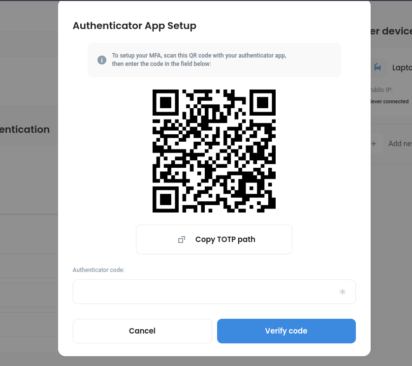
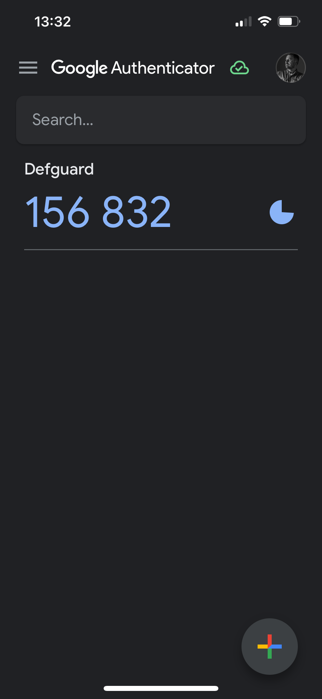
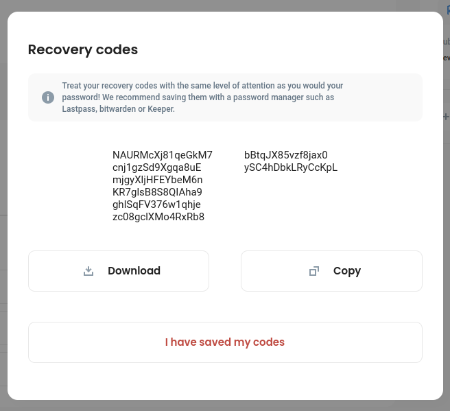

# Setting up 2FA/MFA

Go to _My Profile_ and click _Edit:_

<figure><figcaption></figcaption></figure>

Then scroll down to the section _Two-factor methods_ and choose which one you want to activate.


Whatever the method you will choose to configure next, please be prepared to do backup of your **Recovery backup codes** - as those are generated during the initial/first setup.


### One time password

This method is based on time-based codes (TOTP), generated by an app.

Before you start to configure this step, you need to choose an app for generating your TOTP codes. Most popular are:

* [Google Authenticator for Android/iPhone/iPad](https://support.google.com/accounts/answer/1066447)
* [Bitwarden](https://bitwarden.com/help/authenticator-keys/) - which is a password manager which can help you to store/generate a secure password for your defguard login but also setup TOTP

In this example, we will set up using Google Authenticator.

Click on the _gear_ icon for _One time password_ and _**Enable**:_

<figure><figcaption></figcaption></figure>

A set up screen will show up with a QR Code:

<figure><figcaption></figcaption></figure>

Now open _Authenticator_ mobile app, and click: _**Add a code -> Scan a QR code**_** and scan the QR Code with the app**.

After doing that, a new screen will show on the _Authenticator_ app, that will generate codes for Defguard:

<figure><figcaption></figcaption></figure>

**Enter the code you see on the mobile app**, to confirm, that the process has been done correctly (defguard will now validate the code).

After the code has been validated, either:

* you are all set, the method is enabled and you will be logged out to log in again using MFA
* or you [will need to backup your recovery codes](setting-up-2fa-mfa.md#backing-up-recovery-codes) - and after that you will be logged out as well.

### Backing up recovery codes

If you are configuring the 2FA/MFA for the first time with any selected method, at the end of the process you will be asked to backup your recovery codes:

&#x20;

<figure><figcaption></figcaption></figure>


Please backup those codes in a safe place, if you will not be able to login with your 2FA method (eg. you lost your phone or YubiKey hardware key) - the only method to login will be to use one of the **recovery codes.**

