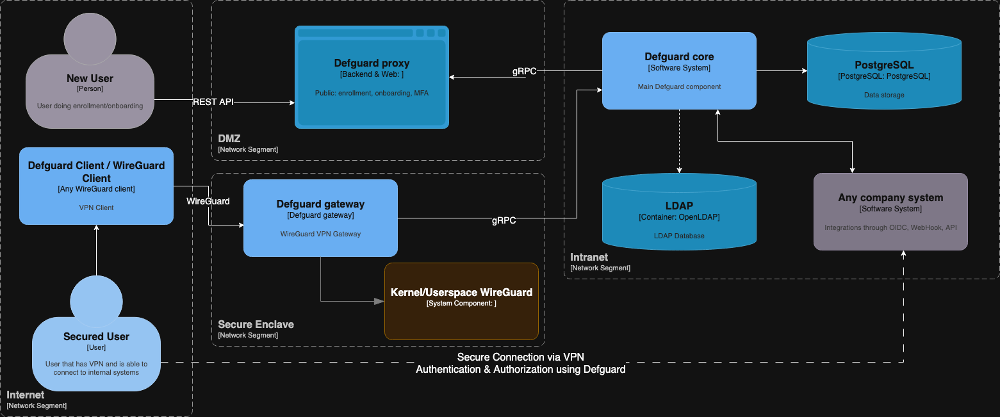
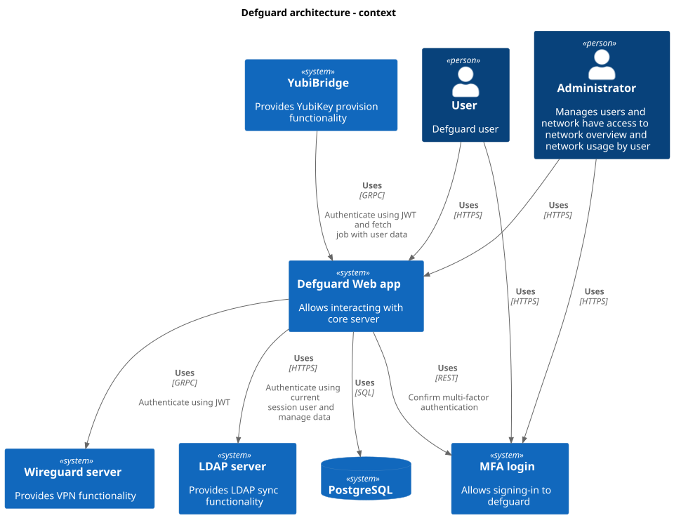
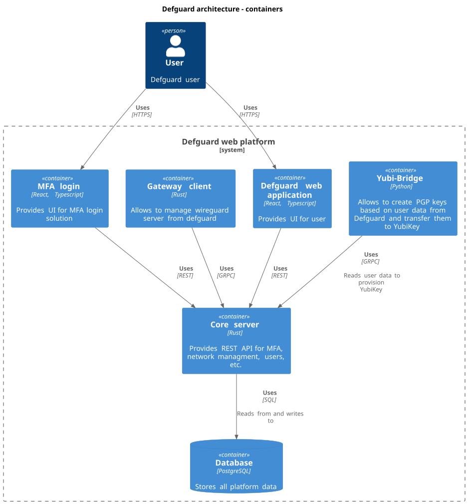
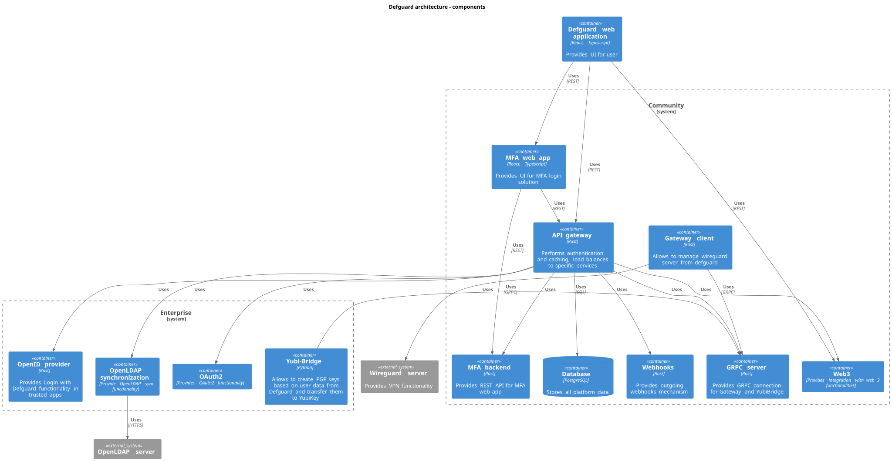

# Architecture

By design **defguard core (the main component) is meant to be deployed in your secure network segments** (available only from an internal network or by VPN) and operations that require public access (like user onboarding, enrollment, password reset, etc.) **are done using a secure proxy:**

<figure><figcaption>
defguard architecture
</figcaption></figure>

This approach is vastly different from most (if not all) VPN/IdP solutions, which are a simple or monolithic application focus on functionalities (like generating configs, managing users, etc.) and most of the time is publicly available in the Internet for any attacker.

If you want full privacy, defguard only exposes publicly **components designed for this purpose:**

* WireGuard® gateway - to enable VPN access
* Public Proxy for secure remote processes like:
  * [User enrollment and onboarding](../../admin-and-features/remote-user-enrollment/)
  * [Desktop Client configuration](../../enterprise/all-enteprise-features/automatic-real-time-desktop-client-configuration.md)

## C4 component model

Below you can see Defguard architecture in [C4 model](https://c4model.com/) divided into context, containers and components.

## Context

## Containers

## Components

### Basics

Core is a Rust web server which is exposed as REST API and gRPC web server with typescript and rust clients, it handles connection to database, LDAP server and gateway. Core also handles user authorization via LDAP account. It's configurable using Environmental Variables which you can find [here](../../configuration.md).

Gateway is a small CLI gRPC client written in Rust which sends network statistics to Core server and apply network configuration changes on message from core.\
Our frontend is React app written in Typescript which allows handling all API calls via Web UI.\
See detailed gRPC docs [here](https://google.com)

### Example setup flow

After creating your network in our wizard and running our gateway program core will message it with network data. Gateway after receiving data will setup your network using wireguard commands you can think of it like a wrapper on wireguard commands which also sends network information through gRPC. After successfully setting up your network gateway will start sending your networks stats in period given as argument on gateway program start or if not provided at default which is 60 seconds. You can see all of your network statistics, connected users, bandwidth, user devices on the overview page.
