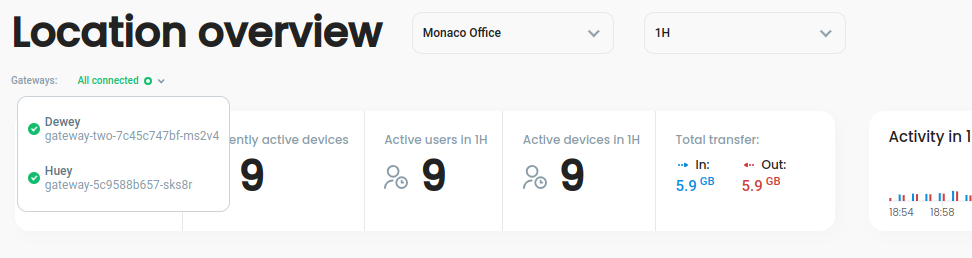

# Changelog

## v0.7.1

#### One-line install

We've created a one-line install script to simplify your first defguard deployment.\
You should now be able to get your own instance running on a private VPS just by setting a couple environment variables and running:

```
curl --proto '=https' --tlsv1.2 -sSf -L https://raw.githubusercontent.com/DefGuard/deployment/main/docker-compose/setup.sh -O && bash setup.sh
```

## v0.7.0 - Remote user enrollment & on-boarding, Email, ...

### Remote user enrollment process

The main defguard concept is that the _core_ (with the database) should be deployed securely and not available from the public Internet (accessible only from the internal network or VPN). This approach raised a significant problem with onboarding new remote users: how can users access defguard, set up password, and add their devices to access VPN or change their password if they can't access defguard?

We introduced a **public proxy** that now enables a **secure enrollment process**, during which the user can: double-check their data, setup their password, and add their initial device to access VPN as a nice wizard!

[](../releases/0.7/enrollment.png)

In the future, we plan to add more functionalities to the public proxy - like password reset for users.

### User onboarding after enrollment

Now you can easily share with new users **any relevant company information, links to company systems, security guidelines**, etc. In the enrollment module, you can write **custom messages** using [markdown](https://spec.commonmark.org/0.30/) that will be shown on the last step of the enrollment process and sent to the user via email:

[](../releases/0.7/enrollment\_msg.png)

### Email/SMTP support

In Setup -> SMTP tab you can setup and test your SMTP for sending email (for enrollment and onboarding).\
**SMTP setup is required** in order for enrollment & onboarding to work.

### Send debug/support information

Now you can go to Settings -> Support and download (or send via email automatically if you have setup SMTP) support data & logs if you need our help/assistance!\
Or you can use them when submitting a bug.

### UI Library

Our beautiful React UI is now a collection of React components, that can be used in other projects! Get it at: [https://github.com/defguard/ui](https://github.com/defguard/ui) (now used in Core & Proxy - soon desktop clients).

### Native FreeBSD Wireguard Kernel support

Our [gateway](https://github.com/defguard/gateway) now supports native kernel Wireguard implementation - and we released a FreeBSD package.

### OPNSense Plugin

On the [gateway release](https://github.com/DefGuard/gateway/releases) page you will now find OPNSense Plugin package (named: defguard-gateway\_0.5.2\_x86\_64-unknown-opnsense.txz)

## v0.6.1 - released 2023.07.26

### ✨ Purge Wireguard VPN old stats

For now, we support only 24h window into stats (more detailed stats we plan to do using OpenTelemetry and Prometheus exporter for devops/admins to configure their dashboards and all events stats according to their needs).

So a lot of stats data is gathered, not used. We need to purge them.&#x20;

#### Other changes

Please visit the [GithHub release page](https://github.com/DefGuard/defguard/releases/tag/v0.6.1).

## v0.6.0 - released 2023.07.25

### ✨ Multiple VPN locations

**Problem**

defguard right now only supports one VPN network/location and one gateway ([Wireguard VPN configuration microservice](architecture.md)) instance for that location.

**Solution**

Implement supporting multiple VPN networks/locations

* configuring/editing/deleting
* **allow only selected groups/users (currently we support two: All users & Admin) to connect to selected Location/VPN**
* displaying detailed statistics for each VPN/Location
* allowing users to download the configuration for each device for any Location/VPN network&#x20;

### ✨ Multiple Gateways' for High Availability/Failover

**Problem**

Some companies (including ours) have infrastructure requirements for their systems to support **high availability/failover** to secure business continuity. VPN for some companies (remote access to their systems) is critical. In defguard, the component responsible for configuring/managing VPN connections is the [gateway](https://github.com/DefGuard/gateway). In order to provide HA/Failover we would need to spawn a gateway on each firewall/router and defguard would need to support multiple gateways.

**Solution**

Support multiple instances of gateway service in order to provide **high availability/failover and** display the status of each gateway:



#### Other changes

Please visit the [GithHub release page](https://github.com/DefGuard/defguard/releases/tag/v0.6.0).
