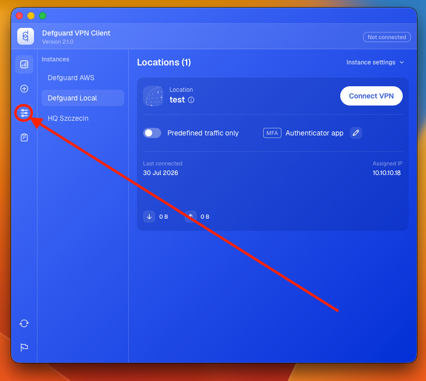
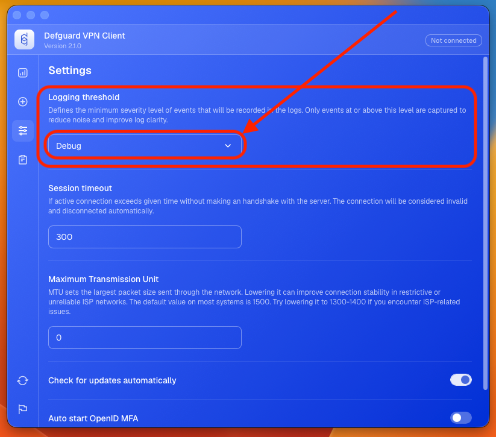
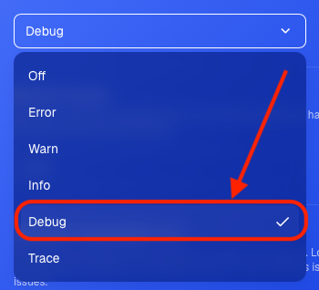
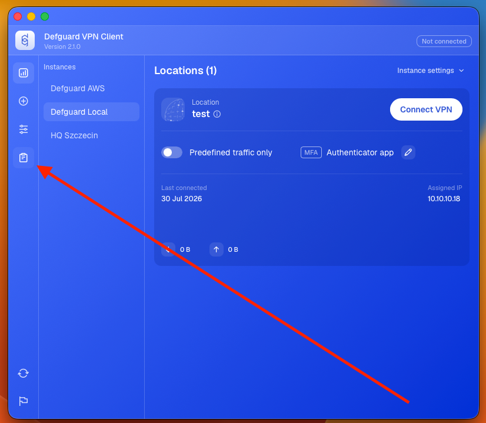
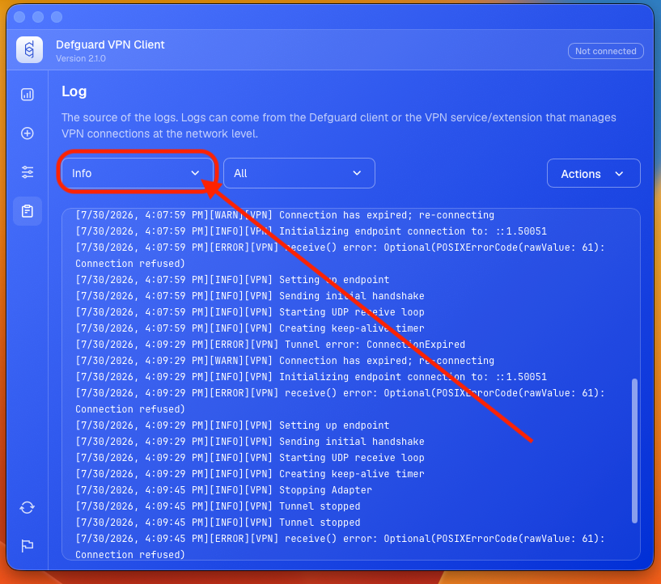
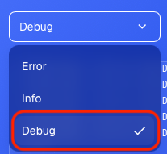
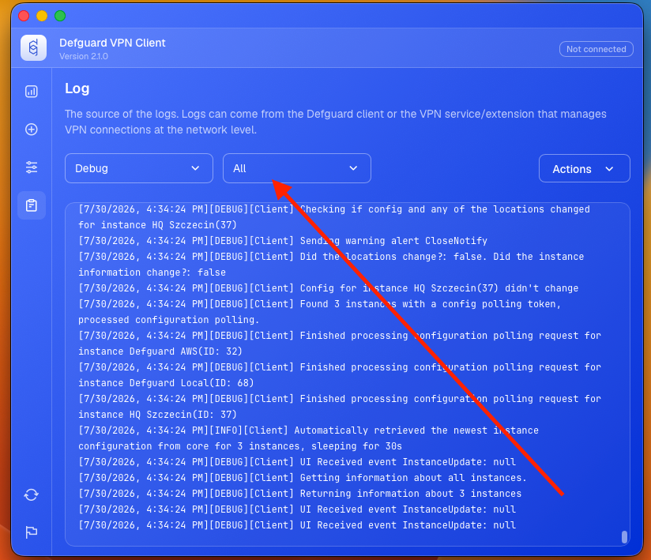
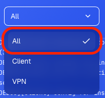
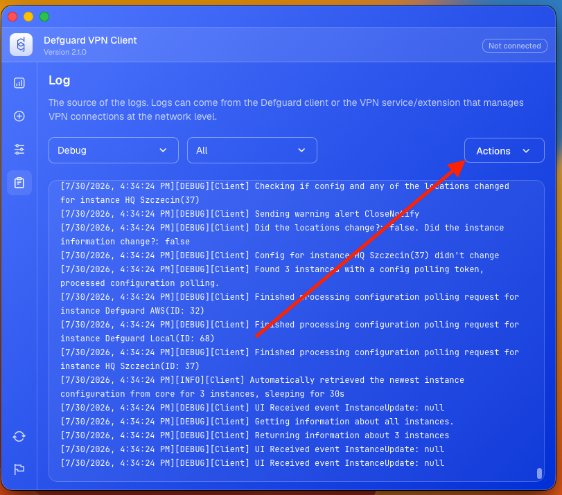
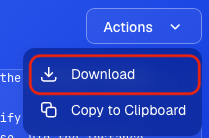

# Desktop Client

In order to provide more detailed information, please do the following:

#### Enable DEBUG logs in the client

1. If you don't have **Defguard** in full view mode, open **Defguard** from tray view, and click **Open Defguard**

<figure><figcaption></figcaption></figure>

2. Go to settings tab.

<figure><figcaption></figcaption></figure>

3. Click on currently selected opton in **Logging threshold** section.

<figure><figcaption></figcaption></figure>

4. Choose `Debug` from list.

<figure><figcaption></figcaption></figure>

#### Gather more logs before sending

Before submitting the logs, after you have changed the logging to debug, please repeat any actions that have caused any problems.

#### Collecting the client logs

1. If you don't have **Defguard** in full view mode, open **Defguard** from tray view, and click **Open Defguard**

<figure><figcaption></figcaption></figure>

2. Go to Log tab.

<figure><figcaption></figcaption></figure>

3. Click on the filter on the left.

<figure><figcaption></figcaption></figure>

4. Set filter to `Debug`.

<figure><figcaption></figcaption></figure>

5. Click on the filter on the right.

<figure><figcaption></figcaption></figure>

6. Set filter to `All`.

<figure><figcaption></figcaption></figure>

7. Click on actions menu.

<figure><figcaption></figcaption></figure>

8. Download logs

<figure><figcaption></figcaption></figure>

9. Save file.
