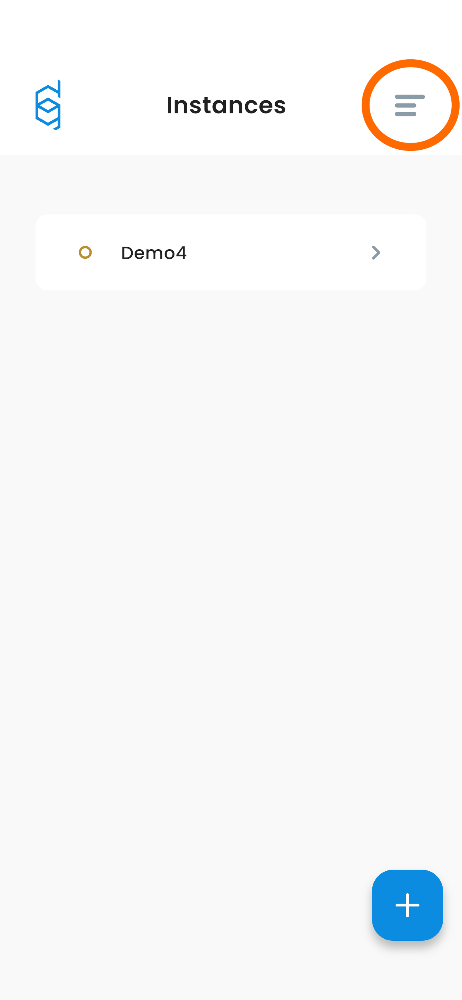
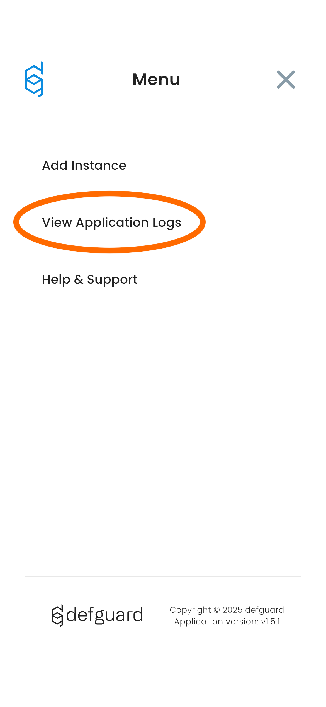
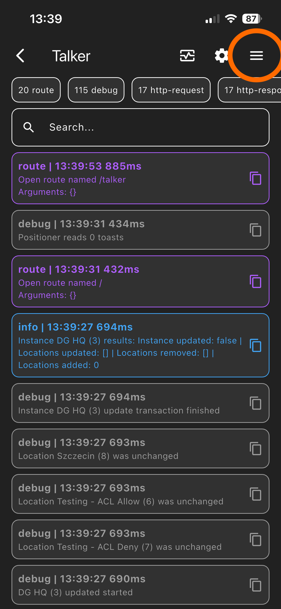
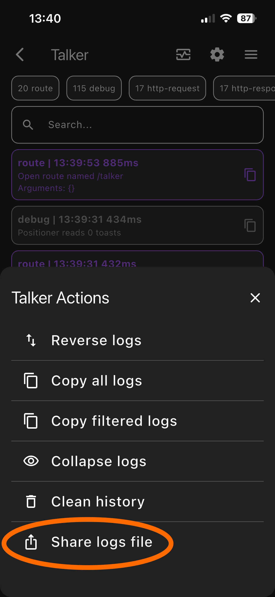

# Sending support information

## Desktop Client

In order to provide more detailed information, please do the following:

#### Enable DEBUG logs in the client

In client settings you can enable more detailed logs by going to: _Settings -> Logging threshold -> Select: Debug_:

<figure><figcaption></figcaption></figure>

#### Gather more logs before sending

Before submitting the logs, after you have changed the logging to debug, please repeat any actions that have caused any problems.

#### Sending the client logs

You can easly send us client logs by going _Settings ->_ in the _Log_ window you will have the possibility to see the logs, but also two buttons, to Copy the logs or Download them - so you can easly share them with us:

<figure><figcaption></figcaption></figure>

## Mobile client

To view the mobile client logs open the side menu by tapping the menu icon.

<figure><figcaption></figcaption></figure>

Tap the _View Application Logs_ link from the side menu.&#x20;

<figure><figcaption></figcaption></figure>

You will  see the application logs. Tap the menu icon again to see possible actions.

<figure><figcaption></figcaption></figure>

Tap the _Share logs file_ item to sent the log file using a desired app.

<figure><figcaption></figcaption></figure>

## Core

When contacting support you can send us **anonymous** support data by:

1. In **Settings > Support** tab you'll be able to generate and send support data that can be used when debugging your issues.
2. To download configuration and logs use appropriate buttons. You can attach them to bug report in our GitHub repository or send them in Matrix.
3. The "Send email" button is active only if you [configured the SMTP server](../../features/notifications/setting-up-smtp-for-email-notifications.md).
