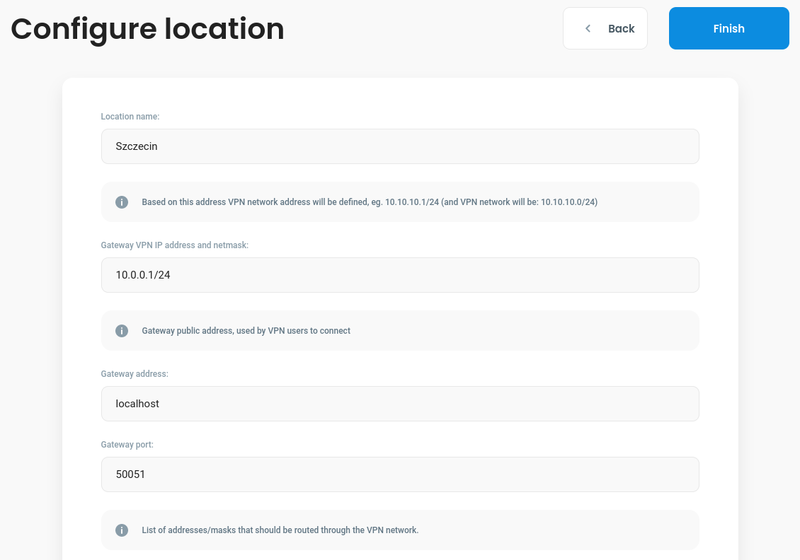

# Standalone Debian package based instalation

## Introduction

This guide will walk you through the process of installing and running Debian packages (.deb) for **core, gateway, proxy** services. We will cover system requirements, additional dependencies, installation steps, and examples of running the installed packages with configuration. (this guide will not cover all possible configurable things, the list of all environmental variables for packages you can find in [Configuraion](https://defguard.gitbook.io/defguard/admin-and-features/setting-up-your-instance/configuration))

If you want to read more about those packages, please go to [Introduction](https://defguard.gitbook.io/defguard).

Examples will be made by using **[Debian 12](https://www.debian.org/releases/stable/releasenotes)**.

### Hardware Requirements

To run defguard components you should meet these expectations of your hardware - [Hardware requirements](https://defguard.gitbook.io/defguard/admin-and-features/setting-up-your-instance).

### System Requirements

Before proeeding with the installation, ensure your system meets the following requirements:

* Debian-based operating system (Debian, Ubuntu, etc.)
* Administrative (sudo) privileges
* Internet connection for downloading packages

### Prequesities

#### PostgreSQL

Defguard services utilitize postgresql so if you do not have installed and configured yet, you can do it with this [guide](https://wiki.debian.org/PostgreSql). For this tutorial we need to create **a user with superuser priviliges and database**. Remember database configuration, because we will need it during [Run Core](#run-core) section. 
* [Database configuration variables](https://defguard.gitbook.io/defguard/admin-and-features/setting-up-your-instance/configuration#database-configuration)

### Additional dependencies

If there are any missing dependencies during installation, we recommend to fix them using the following command:

```
# apt-get install -f
```

## Installation 

### Core service

Navigate to [core repository release](https://github.com/DefGuard/defguard/releases) and choose version of core package that you want to obtain that has debian package and then swap `<version>` in the following command:

```
# wget https://github.com/DefGuard/defguard/releases/download/<version>/defguard-<version>-x86_64-unknown-linux-gnu.deb
```

Example: 
```
# wget https://github.com/DefGuard/defguard/releases/download/v0.11.0/defguard-0.11.0-x86_64-unknown-linux-gnu.deb
```
You can also download directly from the Github realse page, but please note that you should know the path where this could be storead after downloading. Once the package is downloaded, install it using dpkg: 
```
# dpkg -i defguard-<version>-x86_64-unknown-linux-gnu.deb
```

Example:
```
# dpkg -i defguard-0.11.0-x86_64-unknown-linux-gnu.deb
```

You can check is core installed properly:
```
# defguard -V
defguard 0.11.0
```
### Gateway service

Navigate to [gateway repository release](https://github.com/DefGuard/gateway/releases) and choose version of core package that you want to obtain that has debian package and then swap `<version>` in the following command:

```
# wget https://github.com/DefGuard/gateway/releases/download/<version>/defguard-gateway_<version>_x86_64-unknown-linux-gnu.deb
```

Example: 
```
# wget https://github.com/DefGuard/gateway/releases/download/v0.7.0/defguard-gateway_0.7.0_x86_64-unknown-linux-gnu.deb
```
You can also download directly from the Github realse page, but please note that you should know the path where this could be storead after downloading. Once the package is downloaded, install it using dpkg: 
```
# dpkg -i defguard-gateway_<version>_x86_64-unknown-linux-gnu.deb
```

Example:
```
# dpkg -i defguard-gateway_0.7.0_x86_64-unknown-linux-gnu.deb
```

You can check is core installed properly:
```
# defguard-gateway -V
defguard-gateway 0.7.0
```

### Proxy service

Navigate to [proxy repository release](https://github.com/DefGuard/proxy/releases) and choose version of core package that you want to obtain that has debian package and then swap `<version>` in the following command:

```
# wget https://github.com/DefGuard/proxy/releases/download/<version>>/defguard-proxy-<version>-x86_64-unknown-linux-gnu.deb
```

Example: 
```
# wget https://github.com/DefGuard/proxy/releases/download/v0.5.0/defguard-proxy-0.5.0-x86_64-unknown-linux-gnu.deb
```
You can also download directly from the Github realse page, but please note that you should know the path where this could be storead after downloading. Once the package is downloaded, install it using dpkg: 
```
# dpkg -i defguard-proxy-<version>-x86_64-unknown-linux-gnu.deb
```

Example:
```
# dpkg -i defguard-proxy-0.5.0-x86_64-unknown-linux-gnu.deb
```

You can check is core installed properly:
```
# defguard-proxy -V
defguard-proxy 0.5.0
```

## Running defguard

### Run core

To run basic core service we need to configure few env variables. We recommend to create a new env file where you can save [Database configuration](https://defguard.gitbook.io/defguard/admin-and-features/setting-up-your-instance/configuration#database-configuration) and few of [Core configuration](https://defguard.gitbook.io/defguard/admin-and-features/setting-up-your-instance/configuration#core-configuration).

First version of the config file for core should look like this:
```
# Database configuartion

export DEFGUARD_DB_HOST=<your_database_host>
export DEFGUARD_DB_PORT=<your_database_port>
export DEFGUARD_DB_NAME=<your_database_name>
export DEFGAURD_DB_USER=<your_username>
export DEFGUARD_DB_PASSWORD=<your_user_password>


# Core configuration 

export DEFGUARD_SECRET_KEY=<your_secret_key>
# by default http://localhost:8000, if you want use this value please comment the line below
export DEFGUARD_URL=<your_url>
```


You can generate random strings for secrets with e.g.:

`openssl rand -base64 55 | tr -d "=+/" | tr -d '\n' | cut -c1-64`


Example:
```
# Database configuartion

export DEFGUARD_DB_HOST=localhost
export DEFGUARD_DB_PORT=5432
export DEFGUARD_DB_NAME=defguard
export DEFGAURD_DB_USER=defguard
export DEFGUARD_DB_PASSWORD=defguard


# Core configuration 

export DEFGUARD_SECRET_KEY=h3wEFdTfTK9aVDulRt9TMPknLY9oVmz13k7tx5Azpj5Y9E9C7hoT11OtiPfzSRBw
export DEFGUARD_URL=http://localhost:8000
```

Remember to source your env variables:
```
source <path_to_your_defguard_env>
```

After creating a config file now we can launch core service for the first time!
```
# defguard
2024-07-27T11:47:21.796847Z  INFO defguard: Starting defguard
2024-07-27T11:47:21.796881Z  INFO defguard::db: Initializing DB pool
2024-07-27T11:47:21.848475Z  INFO defguard: Using HMAC OpenID signing key
2024-07-27T11:47:22.509151Z  INFO defguard::db::models::user: Initializing admin user
2024-07-27T11:47:22.535824Z  INFO defguard::db::models::settings: Initializing default settings
2024-07-27T11:47:22.580647Z  INFO defguard::wireguard_peer_disconnect: Starting periodic disconnect of inactive devices in MFA-protected locations
2024-07-27T11:47:22.580729Z  INFO defguard::wireguard_stats_purge: Starting periodic purge of stats older than 30days every 1day
2024-07-27T11:47:22.583353Z  INFO defguard: Started web services
```

We can also test it on another terminal tab:
```
$ curl http://localhost:8000/api/v1/health
alive
```
Success! We can move on to the next service.

### Run gateway

To run gateway, we should do two things:
* setup our first location on core service that you create earlier to get `token` and `grpc_url` variables,
* create a new config.toml file. 

#### Setup location for gateway

Now, after setting up core service you should go to the website that you set on `DEFGUARD_URL` (if this variable was not set by you, go to page: `http://localhost:8000`). The link should redirect you to login page, if you not set your [own password](https://defguard.gitbook.io/defguard/admin-and-features/setting-up-your-instance/configuration#core-configuration) for admin the data should look like this:
* login: admin
* password: pass123

Now we can configure our first location. Depends on what is more convenient fo you, choose configuration from Wireguard file or do it manualy.
<figure><figcaption><p>Location setup</p></figcaption></figure>

You can find an example manual configuration if you choose localhost for core service
<figure><figcaption><p>Manual configuration</p></figcaption></figure>

After saving configuration for location you should be redirect to Location overview page, where at the top right corner is `Edit Locations Settings` button, click on it.
<figure><figcaption><p>Manual configuration</p></figcaption></figure>

In `Gateway server setup` copy two variables: `DEFGUARD_TOKEN` and `DEFGUARD_GRPC_URL` 
<figure><figcaption><p>Gateway server setup</p></figcaption></figure>

#### Create config file
After getting `DEFGUARD_TOKEN` and `DEFGUARD_GRPC_URL` variables, we can configure our gateway service. Create config.toml file and swap `<your_gateway_token>` and `<defguard_grpc_url>` with your values that you copied.

Template for configure gateway service looks like below:
```
# This is an example config file for defguard VPN gateway
# To use it fill in actual values for your deployment below

# Required: secret token generated by defguard
# NOTE: must replace default with actual value
token = "<your_gateway_token>"
# Required: defguard server gRPC endpoint URL
# NOTE: must replace default with actual value
grpc_url = "<defguard_grpc_url>"
# Optional: gateway name which will be displayed in defguard web UI
name = "Gateway A"
# Required: use userspace WireGuard implementation (e.g. wireguard-go)
userspace = false
# Optional: path to TLS cert file
# grpc_ca = cert.pem
# Required: how often should interface stat updates be sent to defguard server (in seconds)
stats_period = 60
# Required: name of WireGuard interface
ifname = "wg0"
# Optional: write PID to this file
# pidfile = defguard-gateway.pid
# Required: enable logging to syslog
use_syslog = false
# Required: which syslog facility to use
syslog_facility = "LOG_USER"
# Required: which socket to use for logging
syslog_socket = "/var/run/log"

# Optional: Command which will be run before bringing interface up
# Example: Allow all traffic through WireGuard interface:
#pre_up = "/path/to/iptables -A INPUT -i wg0 -j ACCEPT
# example with multiple commands - add them to a shell script
#pre_up = "/path/to/shell /path/to/script"

# Optional: Command which will be run after bringing interface up
# Example: Add a default route after WireGuard interface is up:
#post_up = "/path/to/ip route add default via 192.168.1.1 dev wg0"


# Optional: Command which will be run before bringing interface down
# Example: Remove WireGuard-related firewall rules before interface is taken down:
#pre_down = "/path/to/iptables -D INPUT -i wg0 -j ACCEPT"

# Optional: Command which will be run after bringing interface down
# Example: Remove the default route after WireGuard interface is down:
#post_down = "/pat/to/ip route del default via 192.168.1.1 dev wg0"

# A HTTP port that will expose the REST HTTP gateway health status
# STATUS CODES:
# 200 - Gateway is working and is connected to CORE
# 503 - gateway works but is not connected to CORE
#health_port = 55003
```

Now we can run gateway service with configuration above:
```
# defguard-gateway --config <path_to_your_config.toml>
[2024-07-27T16:37:56Z INFO  defguard_gateway::gateway] Starting defguard gateway version 0.7.0 with configuration: Config { token: "***", name: Some("Gateway on server X"), grpc_url: "http://localhost:50055/", userspace: false, grpc_ca: None, stats_period: 60, ifname: "wg0", pidfile: None, use_syslog: false, syslog_facility: "LOG_USER", syslog_socket: "/var/run/log", config_path: None, pre_up: None, post_up: None, pre_down: None, post_down: None, health_port: Some(55003) }
[2024-07-27T16:37:56Z INFO  defguard_gateway::server] Health check listening on 0.0.0.0:55003
[2024-07-27T16:37:56Z INFO  defguard_gateway::gateway] gRPC server connection setup done.
[2024-07-27T16:37:56Z INFO  defguard_wireguard_rs::wgapi_linux] Creating interface wg0
[2024-07-27T16:37:56Z INFO  defguard_wireguard_rs::wgapi_linux] Configuring interface wg0 with config: InterfaceConfiguration { name: "Szczecin", address: "10.0.0.1/24", port: 50051, peers: [], mtu: None, .. }
[2024-07-27T16:37:56Z WARN  netlink_packet_route::link::buffer_tool] Specified IFLA_INET6_STATS NLA attribute holds more(most likely new kernel) data which is unknown to netlink-packet-route crate, expecting 288, got 296
[2024-07-27T16:37:56Z WARN  netlink_packet_route::link::buffer_tool] Specified IFLA_INET6_STATS NLA attribute holds more(most likely new kernel) data which is unknown to netlink-packet-route crate, expecting 288, got 296
[2024-07-27T16:37:56Z INFO  defguard_gateway::gateway] Reconfigured WireGuard interface Szczecin (address: 10.0.0.1/24)
[2024-07-27T16:37:56Z INFO  defguard_gateway::gateway] Stats thread spawned.
[2024-07-27T16:37:56Z INFO  defguard_gateway::gateway] Connected to defguard gRPC endpoint: http://localhost:50055/
```

On the other side, core service should print those informations:
```
2024-07-27T16:37:56.379227Z  INFO defguard::grpc: Adding gateway user with to gateway map for network 3
2024-07-27T16:37:56.385951Z  INFO defguard::grpc::gateway: Configuration sent to gateway client, network [ID 3] Szczecin.
2024-07-27T16:37:56.388651Z  INFO defguard::grpc::gateway: New client connected to updates stream: user, network [ID 3] Szczecin
2024-07-27T16:37:56.388695Z  INFO defguard::grpc: Gateway user connected in network 3
2024-07-27T16:37:56.388810Z  INFO defguard::grpc::gateway: Starting update stream to gateway: user, network [ID 3] Szczecin
```

Great! We can also verify gateway health check by uncommenting last line of your config.toml file
```
# A HTTP port that will expose the REST HTTP gateway health status
# STATUS CODES:
# 200 - Gateway is working and is connected to CORE
# 503 - gateway works but is not connected to CORE
health_port = 55003
```
Now after reloading again `gateway` service, you can try on another terminal command below:
```
# curl -v http://localhost:55003/health
*   Trying 127.0.0.1:55003...
* Connected to localhost (127.0.0.1) port 55003 (#0)
> GET /health HTTP/1.1
> Host: localhost:55003
> User-Agent: curl/7.88.1
> Accept: */*
> 
< HTTP/1.1 200 OK
< content-type: text/plain; charset=utf-8
< content-length: 5
< date: Sat, 27 Jul 2024 16:51:35 GMT
< 
* Connection #0 to host localhost left intact
Alive
```
### Run proxy

To run proxy service, we can do it by:
```
# defguard-proxy
2024-07-27T16:53:58.584154Z INFO defguard_proxy::tracing: Tracing initialized
2024-07-27T16:53:58.584233Z INFO defguard_proxy::http: Starting Defguard proxy server
2024-07-27T16:53:58.584371Z INFO defguard_proxy::http: Skipping rate limiter setup
2024-07-27T16:53:58.584438Z INFO defguard_proxy::http: gRPC server is listening on 0.0.0.0:50051
2024-07-27T16:53:58.585125Z INFO defguard_proxy::http: Defguard proxy server initialization complete
2024-07-27T16:53:58.585262Z INFO defguard_proxy::http: API web server is listening on 0.0.0.0:8080
```
As you can see our proxy service works, copy `gRPC url` and paste it to **core configuration**. 

Example:
```
# Proxy connection configuration
export DEFGUARD_PROXY_URL=http://localhost:50051
```

You can find all possible configruation proxy variables in the [Proxy connection configuration](https://defguard.gitbook.io/defguard/admin-and-features/setting-up-your-instance/configuration#proxy-connection-configuration).

Now realod your .env file and reload **core service** again. You should get additional information besides gateway info.

```
2024-07-27T16:57:19.158521Z  INFO defguard::grpc: Connected to proxy at http://localhost:50051/
```

You can now create on defguard admin panel new users and create for them an enrollment process. [Remote desktop activation](https://defguard.gitbook.io/defguard/help/remote-desktop-activation)
