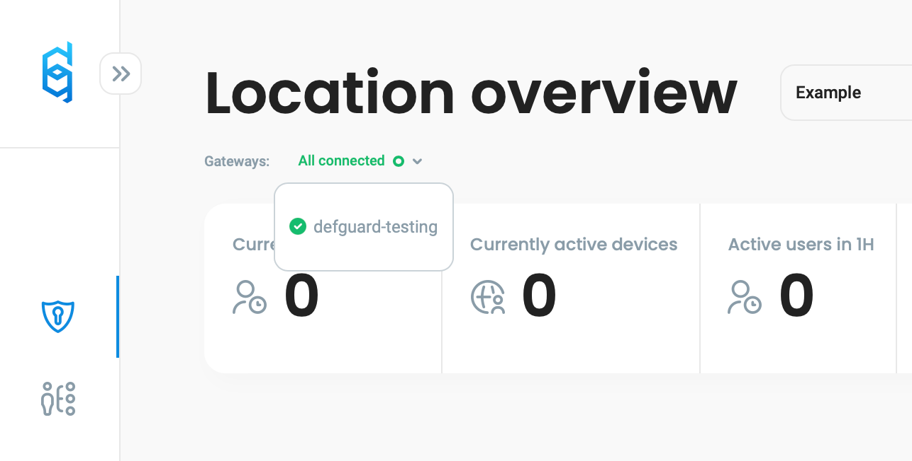

# Step by step setting up a VPN server

### Introduction

This tutorial aims to show how quick and easy is to deploy your VPN server using defguard.

We assume you have:

* a **server with a public IP** (and you know what that IP address is and to which interface it's assigned) - in this example it's: _185.33.37.51_
* you have a **domain name** and know how to assign IP and manage subdomains, in our example:
  * defguard main url will be _my-server.defguard.net_ (and the subdomain is pointed to _185.33.37.51_)
  * defguard enrollment service that will enable to easy configure Desktop Clients just with one token is: _enroll.defguard.net_ (this subdomain also points to _185.33.37.51_)
* server is Debian/Ubuntu-based
* have installed the [official Docker Engine](https://docs.docker.com/engine/install/debian/#install-using-the-repository) and [docker-compose](https://docs.docker.com/compose/install/standalone/#on-linux) (from our experience it's better to use the official Docker Engine then docker shipped with distro packages - but this should also work with distro packages) and have&#x20;
* VPN network will be: 10.22.33.0/24 - but you can assign [any private network address](https://en.wikipedia.org/wiki/Private\_network) and use it in this tutorial - we will name it _Example_
* Server firewall has open ports:
  * 443 - in order to expose both defguard & enrollemnt service - but also to automatically issue for these domains SSL Certificates (which the installer script does)
  * 50555 - on this port the WireGuard VPN server will be listning for incoming connections from clients

### Deploying your VPN server

Deployment is really easy and will be done automatically if you follow these steps.

There are multiple ways to install defguard tailored to your network & infrastructure - in fact, defguard as a VPN server is one of the few to support secure deployments with network segmentation and secure communication, but for the purpose of this tutorial we will do the **easiest setup** and install all components on this server using docker & docker-compose. The installation process will also **automatically configure and deploy all your services and issue SSL certificates.**

To do so just execute by **root** this simple command and follow the instructions:

```
curl --proto '=https' --tlsv1.2 -sSf -L https://raw.githubusercontent.com/DefGuard/deployment/main/docker-compose/setup.sh -O && bash setup.sh
```

In this example we are answering the questions with the following answers:

```
Enter defguard domain [default: ]: my-server.defguard.net
Enter enrollment domain [default: ]: enroll.defguard.net
Use HTTPS [default: false]: true
Enter VPN location name [default: ]: Example
Enter VPN server address and subnet (e.g. 10.0.60.1/24) [default: ]: 10.22.33.1/24
Enter VPN gateway public IP [default: ]: 185.33.37.51
Enter VPN gateway public port [default: ]: 50555
```

When finished you should see the following message:

```
defguard setup finished successfully
If your DNS configuration is correct your defguard instance should be available at:

	Web UI: https://my-server.defguard.net
	Enrollment service: https://enroll.defguard.net

You can log into the UI using the default admin user:

	username: admin
	password: bQ63RSp4o5ZAnIkv
```

<mark style="color:blue;">**And voila! It was that easy!**</mark>

When you log in to your instance with user admin and the password that was generated for you, you should see that the VPN gateway is connected:

<figure><figcaption></figcaption></figure>

#### Enabling to access Internet through your VPN


### Connecting to your VPN using defguard desktop client
