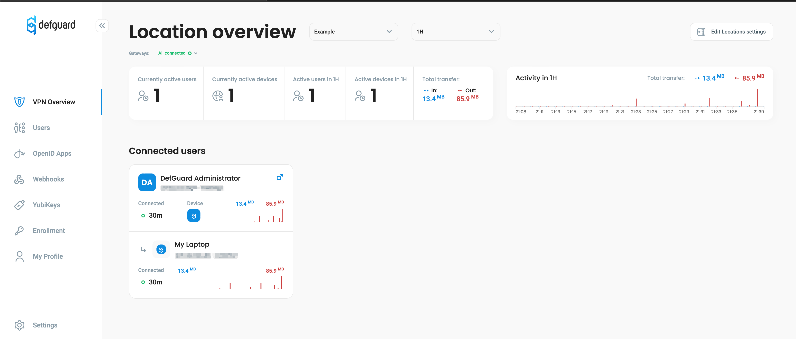

# Step by step setting up a VPN server

### Introduction

This tutorial aims to show how quick and easy is to deploy your VPN server using defguard.

This tutorial is also availabe as a video:



We assume you have:

* a **server with a public IP** (and you know what that IP address is and to which interface it's assigned) - in this example it's: _185.33.37.51_
* you have a **domain name** and know how to assign IP and manage subdomains, in our example:
  * defguard main url will be _my-server.defguard.net_ (and the subdomain is pointed to _185.33.37.51_)
  * defguard enrollment service that will enable to easy configure Desktop Clients just with one token is: _enroll.defguard.net_ (this subdomain also points to _185.33.37.51_)
* server is Debian/Ubuntu-based
* have installed the [official Docker Engine](https://docs.docker.com/engine/install/debian/#install-using-the-repository) and [docker-compose](https://docs.docker.com/compose/install/standalone/#on-linux) (from our experience it's better to use the official Docker Engine then docker shipped with distro packages - but this should also work with distro packages) and have
* VPN network will be: 10.22.33.0/24 - but you can assign [any private network address](https://en.wikipedia.org/wiki/Private\_network) and use it in this tutorial - we will name it _Example_
* If you have a **firewall**, we assume you have **open ports** (if not below we will show you how to enable and secure your server):
  * 443 - in order to expose both defguard & enrollemnt service - but also to automatically issue for these domains SSL Certificates (which the installer script does)
  * 50555 - on this port the WireGuard VPN server will be listning for incoming connections from clients

### Deploying your VPN server

Deployment is really easy and will be done automatically if you follow these steps.

There are multiple ways to install defguard tailored to your network & infrastructure - in fact, defguard as a VPN server is one of the few to support secure deployments with network segmentation and secure communication, but for the purpose of this tutorial we will do the **easiest setup** and install all components on this server using docker & docker-compose. The installation process will also **automatically configure and deploy all your services and issue SSL certificates.**

To do so just execute by **root** this simple command and follow the instructions:

```
curl --proto '=https' --tlsv1.2 -sSf -L https://raw.githubusercontent.com/DefGuard/deployment/main/docker-compose/setup.sh -O && bash setup.sh
```

In this example we are answering the questions with the following answers:

```
Enter defguard domain [default: ]: my-server.defguard.net
Enter enrollment domain [default: ]: enroll.defguard.net
Use HTTPS [default: false]: true
Enter VPN location name [default: ]: Example
Enter VPN server address and subnet (e.g. 10.0.60.1/24) [default: ]: 10.22.33.1/24
Enter VPN gateway public IP [default: ]: 185.33.37.51
Enter VPN gateway public port [default: ]: 50555
```

When finished you should see the following message:

```
defguard setup finished successfully
If your DNS configuration is correct your defguard instance should be available at:

	Web UI: https://my-server.defguard.net
	Enrollment service: https://enroll.defguard.net

You can log into the UI using the default admin user:

	username: admin
	password: bQ63RSp4o5ZAnIkv
```

<mark style="color:blue;">**And voila! It was that easy!**</mark>

When you log in to your instance with user admin and the password that was generated for you, you should see that the VPN gateway is connected:

<figure><figcaption><p>defguard live status of WireGuard VPN gateway</p></figcaption></figure>

### Connecting to your VPN using defguard desktop client

Download the latest client from: [https://github.com/DefGuard/client/releases](https://github.com/DefGuard/client/releases) and install it - which is (during writing this article) version 0.1.1.

No go to **defguard** Web UI (in this example: _https://my-server.defguard.net_) and go to _My Profile_ and click on _Add Device:_

<figure><figcaption><p>Adding a new device/desktop client in defguard user profile</p></figcaption></figure>

Then choose _Defguard Client Remote Desktop Activation_ - which will easly configure your Desktop client:

<figure><figcaption><p>Defguard supports both it's desktop client and configuring any Wireguard Client</p></figcaption></figure>

Defguard will show what **URL** (which is - as you see - your enrollment service URL) and **token** to paste to your desktop client:

<figure><figcaption><p>Just by simply providing URL &#x26; token your client will be automatically configured</p></figcaption></figure>

You can easily copy those with buttons provided in defguard, and paste to your desktop client.

In desktop client click on \_**+ Add instance** \_ and provide the URL and token:

<figure><figcaption><p>Configuring the client with a new instance</p></figcaption></figure>

After that, the client will ask you to name your device (however you like), after that click finish:

<figure><figcaption><p>Naming your device</p></figcaption></figure>

The client will instantly show your defguard instance and the VPN (we named _Example):_

<figure><figcaption><p>Client after succesfully adding a new instance</p></figcaption></figure>

Also, in defguard you should see in your profle, that the client is configured and visible (for now - no details of IPs, etc - will automaticaly show details when you connect with your client):

<figure><figcaption><p>Defguard showing the newly configured client in user profile</p></figcaption></figure>

Now let's click _**Connect**_ and see if the VPN works, the best way to do so, is to open a terminal app and **ping** the VPN server address. Also to see nice statistics, choose in the client menu from _Grid view_ (which is nice if you have multiple VPNs) the option _Detailed view:_

<figure><figcaption><p>Nice statistics in defguard client</p></figcaption></figure>

Now let's test if the VPN network is accessible. To do so, let's ping the VPN gateway internal IP: _10.22.33.1_

<figure><figcaption><p>VPN gateway responding to ping after connecting to VPN</p></figcaption></figure>

As an administrator, you will probably be happy to see this - defguard VPN dashboard:

<figure><figcaption><p>defguard VPN dashboard</p></figcaption></figure>


This completes your VPN setup - both server and client.

But if you would like to configure your VPN server to allow accessing Internet through the VPN gateway, please read the chaptare below.


### Enabling to access Internet through your VPN

The most common purpose to setup your own VPN is to provide you (and your users - defguard supports multiple users!) **anonimity and privacy** when accessing public internet.

It's great for every day use (if you want to _hide_ your real IP/location) or for example to encrypt **all your traffic when your are in a public location -** like beeing on WIFI in a coffee shop, hotels, etc. - since **most if not all those places do not provide encrypted WIFI (just open hotspots).**

So defguard as a VPN service is one thing, but we need to do few commands on the server, to enable routing all traffic through this server and your VPN. For your convenience those we will explain in detail.

First of all we need a simple & easy way to manage firewall. In order to do so on Debian install UFW (it's automatically installed on Ubuntu):

```
root@server# apt install ufw
```

Now let's enable on the firewall rules that provide packet forwarding (from your VPN to the Internet and vice-versa).

Edit the /etc/default/ufw file to enable default policies for packet forwarding to ACCEPT

```
root@server:~# vi /etc/default/ufw
# line 19 : change
DEFAULT_FORWARD_POLICY="ACCEPT"

# reload
root@server:~# ufw reload
```

Edit the /etc/sysctl.conf file to enable pocket forwarding in the kernel:

```
root@server:~# vi /etc/sysctl.conf
# line 28 : uncomment
net.ipv4.ip_forward=1

# reload settings
root@server:~# sysctl -p
```

Now we need to configure firewall [NAT](https://en.wikipedia.org/wiki/Network\_address\_translation), so that the server will "_translate/masq_" VPN traffic behind its public IP. In order to do that, we need to add rules to MASQUERADE VPN network behind the public interface of the sever.

We know that VPN network is 10.22.33.0/24 now we need to be sure what interface has the public IP (in our case: 185.33.37.51) - let's figure it out with this command:

```
root@server:~# ip a | grep 185.33.37.51
    inet 185.33.37.51/24 brd 185.33.37.255 scope global ens18
```

So, our public interface is: **ens18**

Now just add the following to /etc/ufw/before.rules **just before the filter rules**:

```
# NAT table rules
*nat
:POSTROUTING ACCEPT [0:0]

# Forward VPN network traffic through ens18 - Change to match you out-interface
-A POSTROUTING -s 10.22.33.0/24 -o ens18 -j MASQUERADE

# don't delete the 'COMMIT' line or these nat table rules won't
# be processed
COMMIT
```

Typical ufw configuration is that INPUT traffic is disabled, so we need to open ports for our WEB and WireGuard gateway:

```
# allow HTTPS to access defguard
root@server# ufw allow https

# allow WireGuard VPN which is on port 50555 with UDP protocol
root@server# ufw allow 50555/udp

# also you might consider for the time beeing to allow SSH management
# until you learn how to allow traffic to SSH from VPN
root@server# ufw allow ssh
```

On Ubuntu UFW is enabled, but on Debian we need to enable it:

<pre><code><strong>root@server# ufw enable
</strong>Command may disrupt existing ssh connections. Proceed with operation (y|n)? y
Firewall is active and enabled on system startup
</code></pre>

On ubuntu we need to realod the configuration:

<pre><code><strong>root@server# ufw reload
</strong></code></pre>

Let's check the UFW configuration, should look like this:

```
root@server# ufw status verbose
Status: active
Logging: on (low)
Default: deny (incoming), allow (outgoing), allow (routed)
New profiles: skip

To                         Action      From
--                         ------      ----
50555/udp                  ALLOW IN    Anywhere
22/tcp                     ALLOW IN    Anywhere
443                        ALLOW IN    Anywhere
50555/udp (v6)             ALLOW IN    Anywhere (v6)
22/tcp (v6)                ALLOW IN    Anywhere (v6)
443 (v6)                   ALLOW IN    Anywhere (v6)
```

#### Testing your configuration with defguard client

Defguard is the only (known to us) WireGuard client, that enables to choose during connetion if you would like to **route all your traffic through the VPN.** Just (before connecting) choose the option: **Allow all traffic** and click connect!

<figure><figcaption><p>Choosing to forward all traffic through VPN</p></figcaption></figure>

This is very usefull, since some of the times you just want to be connected to your VPN to have the server/vpn networks accessible, and sometimes (like in the scenarious mentioned before) you want to hide and encrypt your traffic.

In order to check if everything works, let's visit a website [https://ifconfig.co](https://ifconfig.co) - that will show our public IP. If everything went smootly, you should see **your VPN server public IP** (which in our example is: _185.33.37.51_):

<figure><figcaption><p>Success! Defguard is AWESOME!</p></figcaption></figure>

## Final thoughts

We put a lot! of effort in development, testing and documentation - to make difficult things like security, VPN easy and good looking. So for now, we kindly ask you to:

* star us on GitHub: [https://github.com/defguard/defguard](https://github.com/defguard/defguard)
* and spread the word about defguard however you like!

Thank you from the whole [defguard team.](https://teonite.com)
