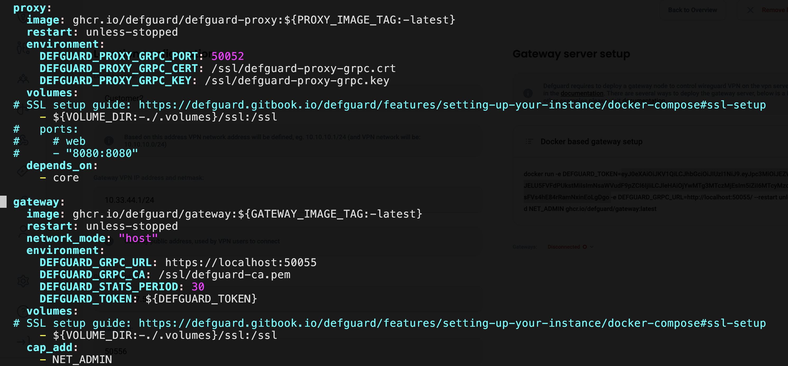

# Adding additional VPN locations

If you have used our one-line install setup (for example [described in this tutorial](./)) one VPN location (one gateway instance) is done automatically.

There is often a need to launch additional locations (e.g. to separate groups of users or clients), to do this you need to add another location (and launch another gateway controlling this location).

Here is a step-by-step way to do so:

### Adding a new Location

In defguard interface in VPN Location please click: **Edit location settings** (button in the top right corner):

<figure><figcaption></figcaption></figure>

Then _**Add new location**_ and configure the new VPN location.


Rember that the:

* VPN IP address needs to be different then in the first location
* Gateway address should be the same (same public IP)
* Gateway port **must be different - and** remember that gateway port **must be open on firewall** (this is the new VPN location WireGuard port)


After configuring the location, please:

* copy the gateway token
* and note that the gateway is disconnected

<figure><figcaption></figcaption></figure>

### Adding new gateway in docker

Now go to the server and open the docker-compose.yml file, and scroll to the gateway section, it should look like this:

<figure><figcaption></figcaption></figure>

Now copy the **whole gateway section and:**

* **name it in a uniqe way,** eg. _gateway-customer2_&#x20;
* in the enviroment variable `DEFGUARD_TOKEN`: add the token you have copied from the new location
* **add the following line below the **_**image**_** -** to change the second gateway WireGuard interface:

```yaml
    command: ["-i", "wg1"]
```


**If you will not add the command line, both gateways will use by default the wg0 and both will not work.**


The configuration should like so:

<figure><figcaption></figcaption></figure>

Now you need to launch the new gateway, just by the following command:

```
docker compose up -d gateway-customer2
```

<figure><figcaption></figcaption></figure>

Now if you go back to the location settings you will see **instantly that the new gateway has connected for that location:**


<figure><figcaption></figcaption></figure>

And that's it, you have a new VPN location ready.
