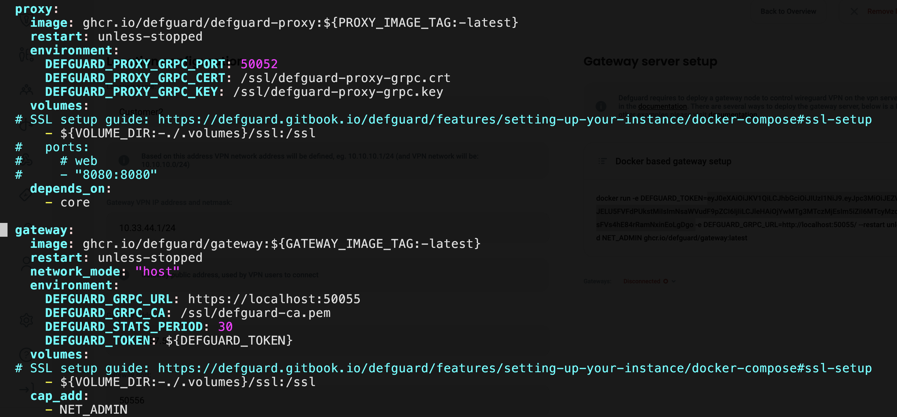

# Adding additional VPN locations

If you have used our one-line install setup (for example [described in this tutorial](./)) one VPN location (one gateway instance) is done automatically.

There is often a need to launch additional locations (e.g. to separate groups of users or clients), to do this you need to add another location (and launch another gateway controlling this location).

Here is a step-by-step way to do so:

### Adding a new Location

In Defguard interface in VPN Location, please click: **Edit location settings** (button in the top right corner):

<figure><figcaption></figcaption></figure>

Then _**Add new location**_ and configure the new VPN location.


Without specified DNS field desktop client may be unable to use "All traffic" connection for the location.



Remeber that the:

* VPN IP address needs to be different then in the first location
* Gateway address should be the same (same public IP)
* Gateway port **must be different - and** remember that gateway port **must be open on firewall** (this is the new VPN location WireGuard port)


After configuring the location, please:

* copy the gateway token
* and note that the gateway is disconnected

<figure><figcaption></figcaption></figure>

### Adding new gateway in docker


This section assumes a new gateway will be launched on the same machine.

If you want to launch a gateway on a separate host please see the[ next section](adding-additional-vpn-locations.md#adding-new-gateway-on-a-remote-host).


Now go to the server and open the `docker-compose.yml` file, and scroll to the gateway section, it should look like this:

<figure><figcaption></figcaption></figure>

Now copy the **whole gateway section and:**

* **name it in a uniqe way,** eg. _gateway-customer2_
* in the enviroment variable `DEFGUARD_TOKEN`: add the token you have copied from the new location
* **add the following line below the&#x20;**_**image**_**&#x20;-** to change the second gateway WireGuard interface:

```yaml
    command: ["-i", "wg1"]
```


**If you will not add the command line, both gateways will use by default the wg0 and both will not work.**


The configuration should like so:

<figure><figcaption></figcaption></figure>

Now you need to launch the new gateway, just by the following command:

```
docker compose up -d gateway-customer2
```

<figure><figcaption></figcaption></figure>

Now if you go back to the location settings you will see **instantly that the new gateway has connected for that location:**

<figure><figcaption></figcaption></figure>

And that's it, you have a new VPN location ready.

### Adding new gateway on a remote host

If you intend to add a new gateway on a different host than the one you've run the [one-line install script](../../getting-started/one-line-install.md) on, there are some additional steps that need to be performed:

* make sure that both hosts can securely communicate within an isolated network segment without exposing the core gRPC port to the public internet as described in our [general network requirements](../../deployment-strategies/hardware-os-network-and-firewall-recommendations.md#server-and-environment-requirements)
* edit you `docker-compose.yaml` and add a `DEFGUARD_GRPC_URL` environment variable to the core service; this should be a URL that a remote gateway is able to connect to as described [here](../../deployment-strategies/configuration.md#grpc-server-configuration)
* after adding the variable restart the core service
* securely transfer the `/ssl/defguard-ca.pem` file to the new host
* depending on your preference create a copy of the `docker-compose.yaml` on the new host (with just the gateway service) or use the command from web UI to start a new gateway
* if using the command remember to add the `DEFGUARD_GRPC_CA` environment variable

&#x20;  &#x20;
