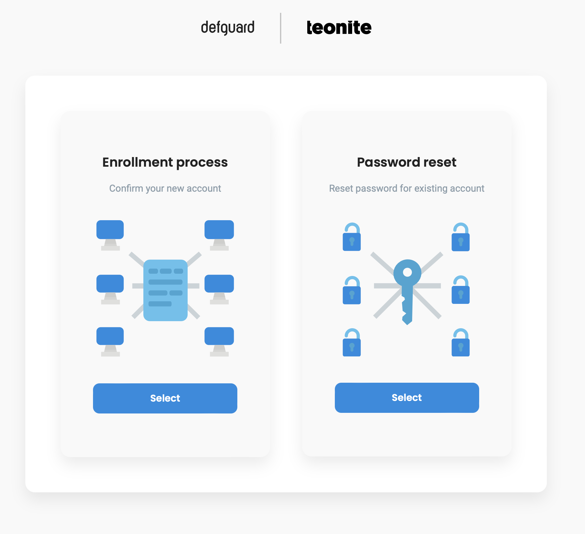
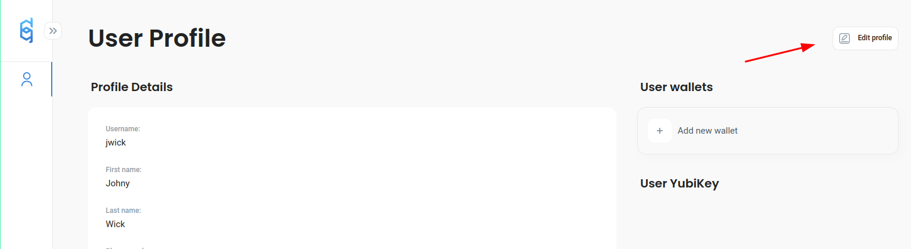
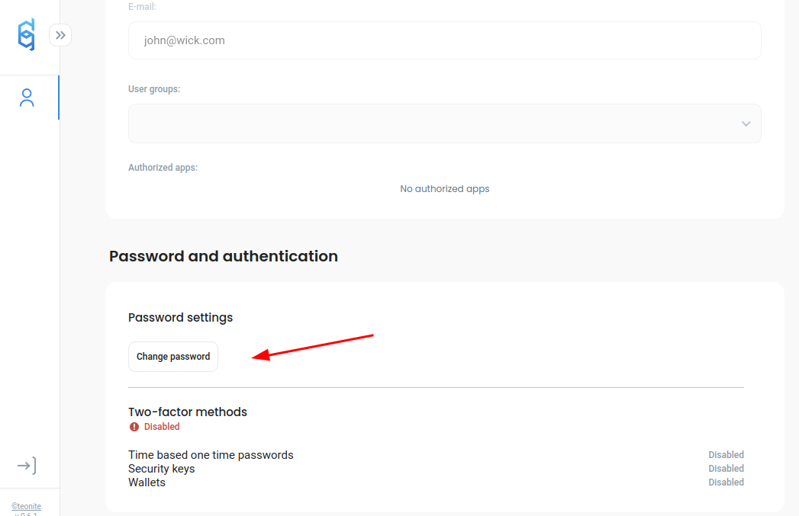
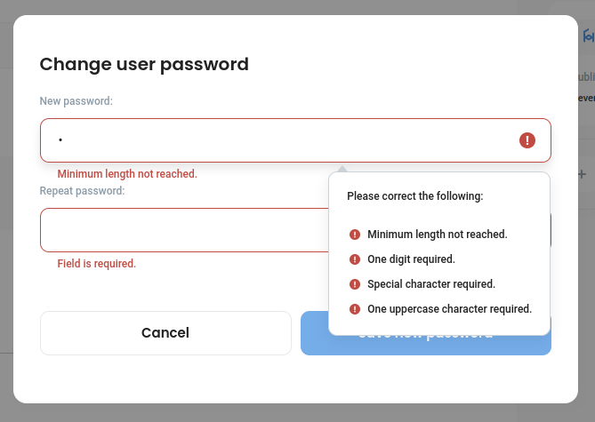

---
metaLinks:
  alternates:
    - >-
      https://app.gitbook.com/s/e86iamwJVSYnIRsyVEAV/using-defguard-for-end-users/changing-your-password
---

# Password change / Reset

## Resetting your password

If you don't have access to Defguard you can reset your password with a link that will be sent to you on your email. Can be done in two ways:

#### Enrollment public page

The same URL you have used to do your remote enrollment & onboarding has the functionality of password reset:

<figure><figcaption>
Password reset in enrollment service
</figcaption></figure>


The enrollemnt service URL should be avaialbe in the onboarding email you have received when finishing the [onboarding\&enrollment process.](enrollment/)


#### By admin

Ask your administrator to send you the password reset link.


You should have you admin contact data on the onboarding message that was sent automatically after you have finished the [onboarding\&enrollment process.](enrollment/)


## Changing your password in Defguard

Go to _My Profile_ and click _Edit:_

<figure><figcaption></figcaption></figure>

Then scroll down and choose _Change Password:_

<figure><figcaption></figcaption></figure>

Set up a new secure password according to the password rules and click _Save new password_

<figure><figcaption></figcaption></figure>
