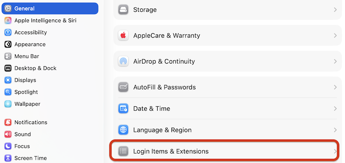
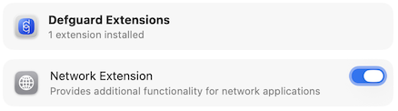
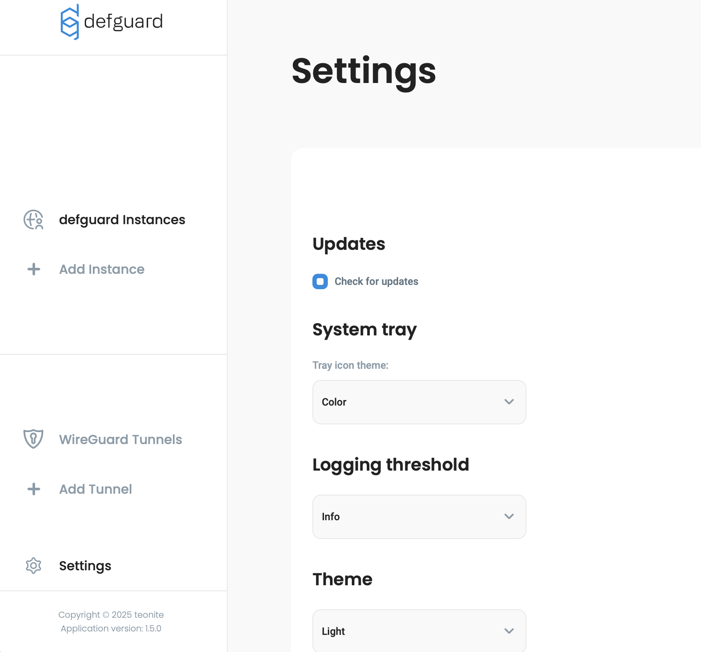
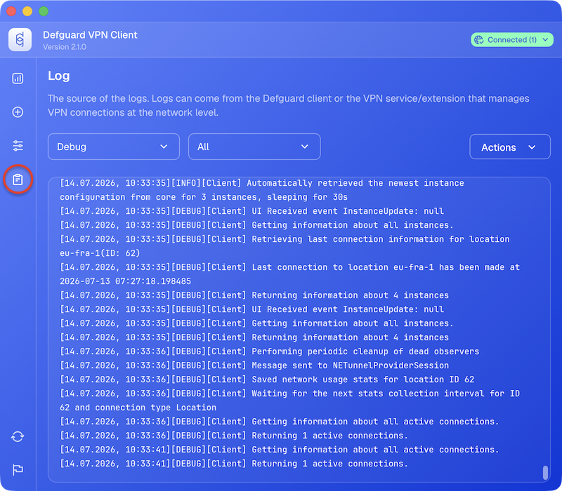

# Desktop Client

## Overview

The Defguard Desktop Client provides an easy way to access the VPN locations of multiple Defguard instances through a single, user-friendly interface. It is available for Windows, macOS, Linux, and BSD.

Key capabilities:

* **Multiple instances and locations** – add as many Defguard instances as you need and switch between their locations from one menu.
* **Multi-Factor Authentication** – supports internal MFA (Authenticator App, email) as well as external OIDC/SSO providers and mobile biometry. The desktop client is required for MFA, as standard WireGuard clients do not support it.
* **Command-line control** – the [`defguard-cli`](command-line-defguard-cli.md) tool ships with the client for headless machines, remote sessions, and scripting.
* **Automatic updates** – the client checks for new releases and notifies you when one is available (this can be disabled in settings).
* **Real-time configuration sync** – with a Business or Enterprise plan, instances and locations stay [synchronized automatically](../../features/remote-user-enrollment/automatic-real-time-desktop-client-configuration.md).

Download the latest release here: [https://defguard.net/download/](https://defguard.net/download/)

For development/pre-releases, go to GitHub: [https://github.com/DefGuard/client/releases/latest](https://github.com/DefGuard/client/releases)

Guides:

* [Instance configuration](instance-configuration.md)
* [Using Multi-Factor Authentication](using-multi-factor-authentication-mfa.md)
* [MTU Setting](mtu-setting.md)
* [Command-line (defguard-cli)](command-line-defguard-cli.md)

## Windows

Download the Windows installer from the [download page](https://defguard.net/download/) (or from [GitHub releases](https://github.com/DefGuard/client/releases)) and run it. The `defguard-cli` command-line tool is installed alongside the client.

## macOS

There are two versions of the Desktop Client available to download:

* [App Store](https://apps.apple.com/pl/app/defguard-desktop-client/id6754601166)
* [Stand-alone application](https://github.com/DefGuard/client/releases/latest) – **Defguard_VERSION_universal.dmg**

These are the differences:

|                                  | App Store version                       | Stand-alone application                                              |
|----------------------------------|-----------------------------------------|----------------------------------------------------------------------|
| Is available                     | in supported countries.                 | everywhere.                                                          | 
| Desktop Client updates           | can be installed automatically.         | have to be installed manually.                                       |
| VPN connection handler           | uses application extension.             | installs a system extension, which requires additional user consent. |
| Disconnecting one VPN connection | also disconnects other VPN connections. | keeps other VPN connections open.                                    |
| Posture checks – disk encryption | cannot be detected.                     | can be detected.                                                     |

### Stand-alone installation

* Download **Defguard_VERSION_universal.dmg** from [releases](https://github.com/DefGuard/client/releases/latest).
* Open the downloaded file – a disk image should mount.
* In the opened window, drag **Defguard.app** to **Applications** folder.
* Unmount the disk image.
* Optionally, delete **Defguard_VERSION_universal.dmg**.

On the first launch of **Defguard.app**, you'll be asked to consent to VPN network extension installation.

* Open **System Settings**.
* Go to **General** → **Login Items & Extensions**.

<figure><figcaption></figcaption></figure>

* Scroll down to **Extensions**.
* Click on **Defguard** and enable its **Network Extension**.

<figure><figcaption></figcaption></figure>

## Linux

After installing the Defguard client package, a '_defguard_' group is added to your system. This group has access to the background service that controls VPN interfaces.

The package installation scripts attempt to detect the user running the installation, but if you install it as "_root_", we cannot determine which user to add to the defguard group—you will need to do this manually.

Additionally, after being added to the group, the user must log out for the changes to take effect.

More details about the group and permissions can be found [here](../../support-1/troubleshooting-guides/desktop-client/unix-socket-permission-error-on-connect-linux.md)


On Linux the desktop client uses `resolvconf` to manage DNS servers. On newer distributions it should be a symbolic link to `resolvectl`, more details can be found on the [troubleshooting](../../support-1/troubleshooting-guides/desktop-client/resolvconf-not-found-debian.md) page.



On Linux the desktop client requires the user to belong to the `defguard` group in order to access the `defguard.socket` Unix socket used for IPC.

The official packages handle group setup, but logging out and back in or rebooting might be required on initial client install to refresh group membership. This is no longer required on subsequent updates.


### ArchLinux

There is an [AUR package : defguard-client](https://aur.archlinux.org/packages/defguard-client).

If you don't know how to install AUR packages, please follow these guidelines:

* Manual install: [https://wiki.archlinux.org/title/Arch\_User\_Repository](https://wiki.archlinux.org/title/Arch_User_Repository)
* Installation through PARU (AUR Helper): [https://owlhowto.com/how-to-install-paru-on-arch-linux/](https://owlhowto.com/how-to-install-paru-on-arch-linux/)

### Ubuntu 22.04 / Debian 12

Download `defguard-client_{x.x.x}_{arch}_ubuntu-22-04-lts.deb` from [releases](https://github.com/DefGuard/client/releases/latest).

## Client update

Defguard Client regularly checks for updates. In order to do so, operating system name and installed application version are sent to the Defguard update service.
This functionality can be turned off in the Client settings, so that no data is sent.

To turn off automatic checking for updates:

* Click **Open Defguard**
* Click **Settings** icon on the left pane.
* Turn off **Check for updates automatically**.

<figure><figcaption></figcaption></figure>

If a new version is available, a notification with a download button will be shown near the bottom of the menu.

### Storage

Application data is stored in following locations:

| Platform            | Storage directory                                |
|---------------------|--------------------------------------------------|
| Windows             | C:\Users\\\<USER>\AppData\Roaming\net.defguard   |
| macOS (App Store)   | ${HOME}/Library/Containers/net.defguard          |
| macOS (stand-alone) | ${HOME}/Library/Application Support/net.defguard |
| BSD/Linux           | ${HOME}/.local/share/net.defguard                |

### Log files

All relevant application logs are available in the client's Settings, where they can be filtered by source and log level:

<figure><figcaption></figcaption></figure>

In case of unexpected issues, the log files themselves can be found in the following default locations:

| Platform            | Client logs                                                            | Background service logs                                  |
|---------------------|------------------------------------------------------------------------|----------------------------------------------------------|
| Windows             | C:\Users\<USER>\AppData\Roaming\net.defguard\logs                      | C:\Logs\defguard-service                                 |
| macOS (App Store)   | ${HOME}/Library/Containers/net.defguard/Data/Library/Logs/net.defguard | ${HOME}/Library/Group Containers/group.net.defguard/Logs |
| macOS (stand-alone) | ${HOME}/Library/Logs/net.defguard                                      | ${HOME}/Library/Group Containers/group.net.defguard/Logs |
| BSD/Linux           | ${HOME}/.local/share/net.defguard/logs                                 | /var/log/defguard-service                                |
