# Instance configuration


Defguard Desktop Client is required if you want to use Multi-Factor Authentication, as any other WireGuard client doesn't support this functionality.


### Obtaining URL and Token


If you are looking for how to generate tokens for your users as an Administrator, look here:

[remote-desktop-activation.md](../../features/wireguard/remote-desktop-activation.md "mention")


1. Log in to your Defguard account.
2. Go to **My Profile** tab and select **Devices** tab.
<figure>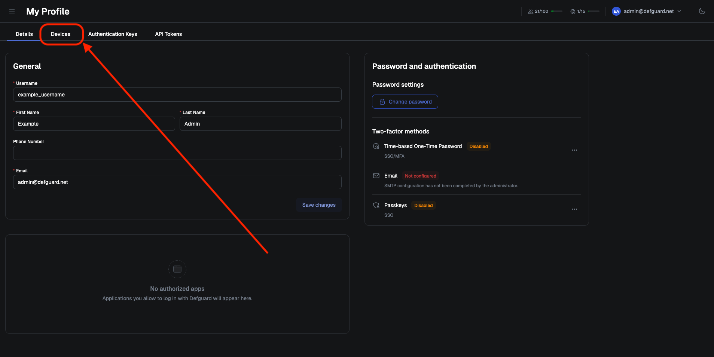</figure>

3. Click **Add new device** button.
<figure>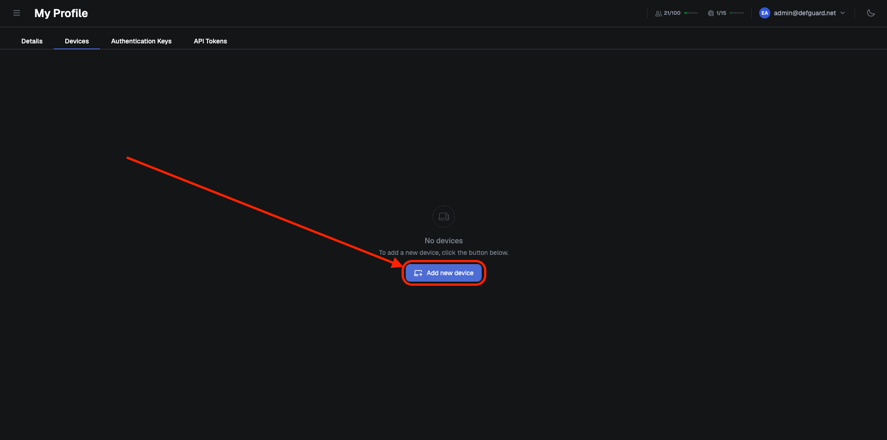<figcaption></figcaption></figure>

4. Click **Client Activation**.

<figure>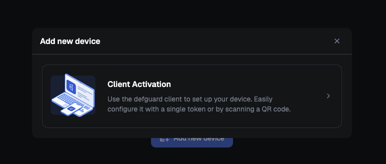<figcaption></figcaption></figure>

5. Afterwards, use **One-Click Configuration** or click **Show advanced configuration** and copy **URL** and **Token** manually.

<figure>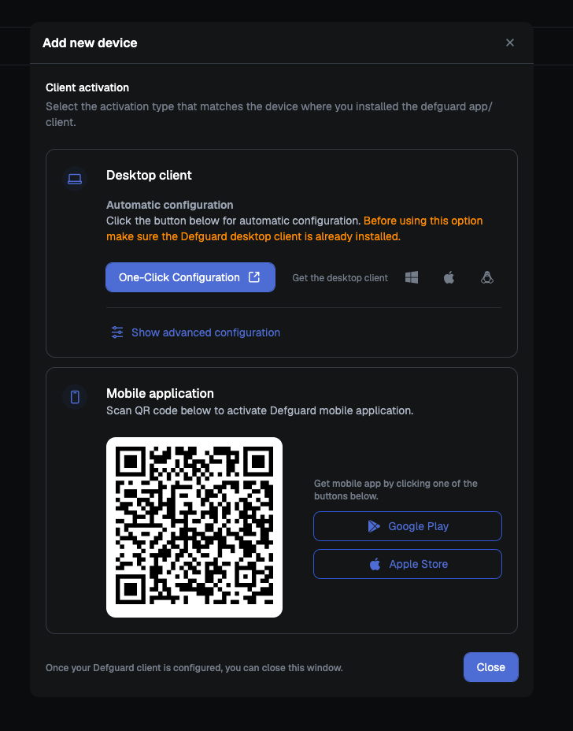<figcaption></figcaption></figure>

### Manually Adding Instance

1. If you don't have **Defguard** in full view mode, open **Defguard** from tray view, and click **Open Defguard**
<figure>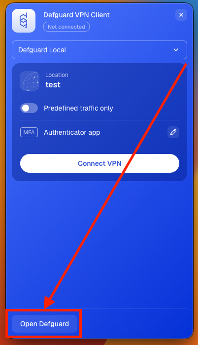</figure>

2. Click **Add Instance**.

<figure>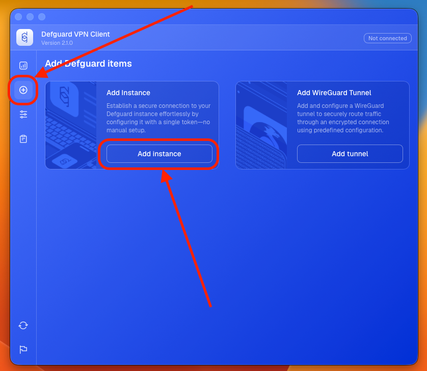</figure>

3. Enter URL, Token and Device name of your choice, then click **Add Instance**. (If you don't have URL/Token, check out [this section](instance-configuration.md#obtaining-url-and-token))

<figure>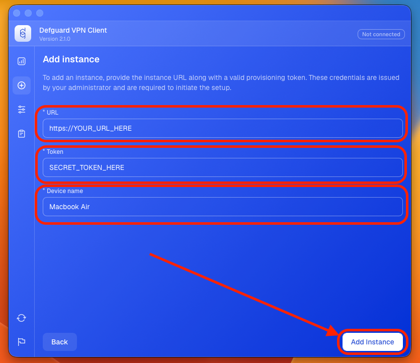</figure>

### One-click Desktop Configuration

You can skip the whole process of entering the token/URL by clicking "One-Click Desktop Configuration". Here is a video describing the whole process:



### Connecting to Instance

#### Desktop client in full view mode

1. Go to **Instances**

<figure>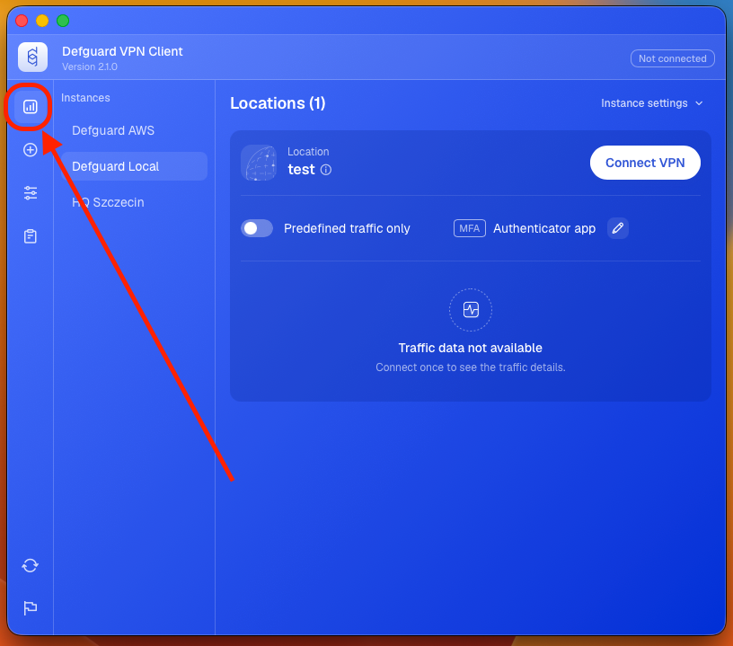</figure>

2. Select the instance you want to use

<figure>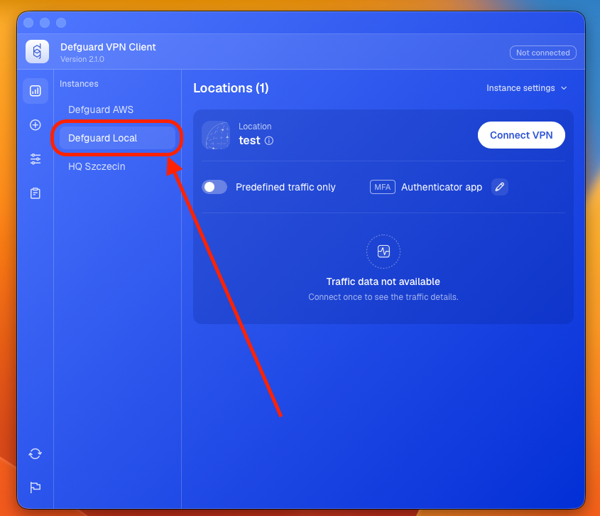</figure>

3. Choose allowed traffic

* **Predefined traffic only** will only route traffic specified by your administrator.
* **All traffic is allowed** will route everything through VPN tunnel.


<figure>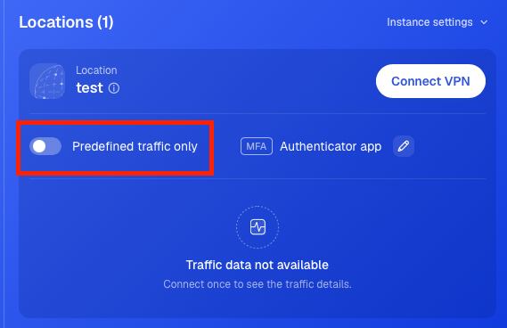</figure>

4. Click **Connect VPN**

<figure>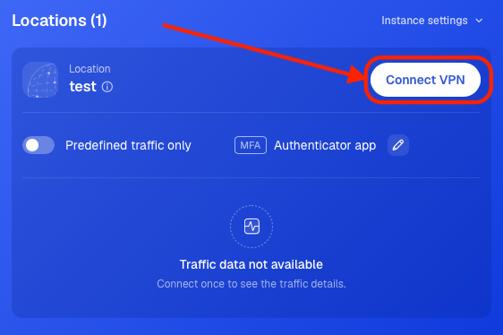</figure>

#### Desktop client in tray view mode

1. Click on instance list

<figure>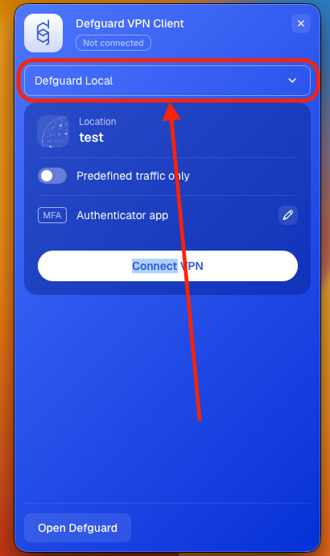</figure>

2. Select the instance you want to connect to

<figure>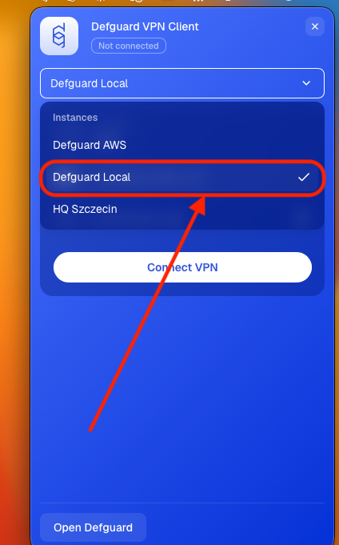</figure>

3. Choose allowed traffic

* **Predefined traffic only** will only route traffic specified by your administrator.
* **All traffic is allowed** will route everything through VPN tunnel.


<figure>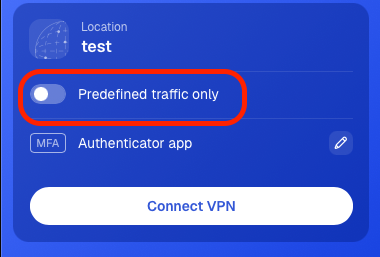</figure>

4. Click **Connect VPN**

<figure>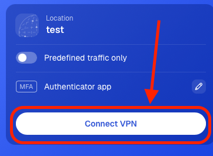</figure>

### Disconnecting from Instance

Click **Disconnect** next to the location you are currently connected to.

<figure>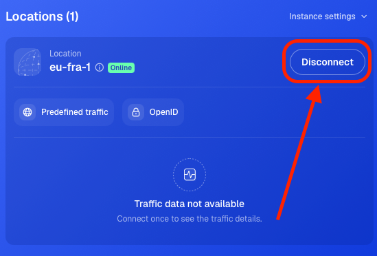<figcaption></figcaption></figure>

### Updating Instance

If you want to update your instance manually:

1. If you don't have **Defguard** in full view mode, open **Defguard** from tray view, and click **Open Defguard**
<figure></figure>

2. Go to your Instance and click **Instance settings**

<figure>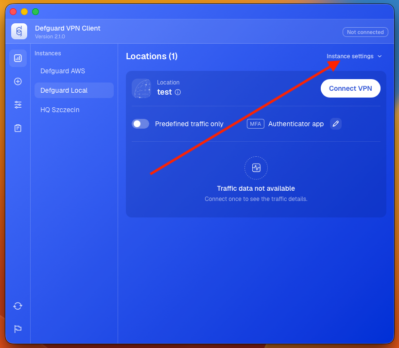</figure>

3. Click **Update**

<figure>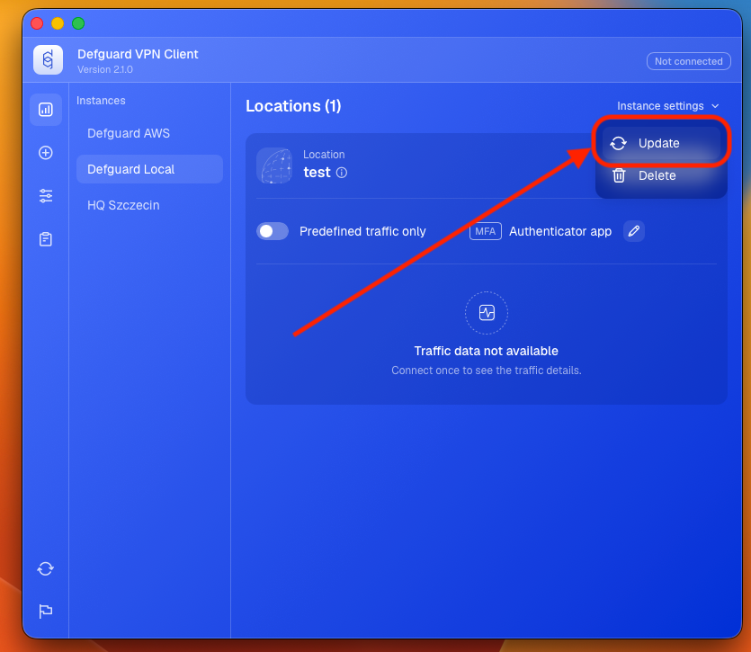</figure>


Only tokens issued from that specific instance will work.


4. Enter Token provided by your administrator, or generate it [on your own](instance-configuration.md#obtaining-url-and-token). Then click **Update**

<figure>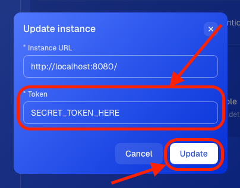<figcaption></figcaption></figure>

Your Instance will update immediately.

### Why do instances need updates?

Defguard Desktop stores all information locally and doesn't communicate with Defguard outside the registration process. This means that the information about an instance is a snapshot of the moment you registered it in the desktop client, and you might want to update it, for example when locations are added or removed.


If you have a Business or Enterprise plan, all desktop clients and all instances are [synchronized automatically and in real-time.](../../features/remote-user-enrollment/automatic-real-time-desktop-client-configuration.md)


### Removing Instance

1. If you don't have **Defguard** in full view mode, open **Defguard** from tray view, and click **Open Defguard**
<figure></figure>

2. Go to your Instance, click **Instance settings**

<figure></figure>

3. Click **Delete**

<figure>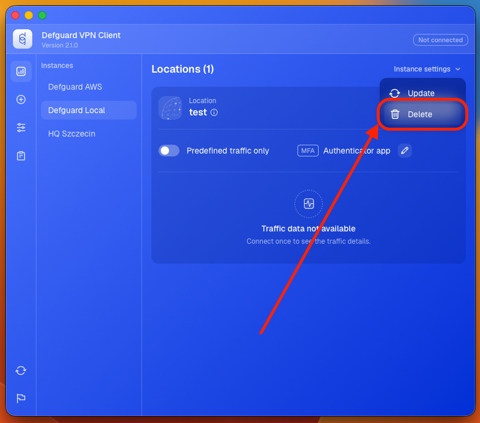</figure>

4. Confirm with **Delete instance** button

<figure>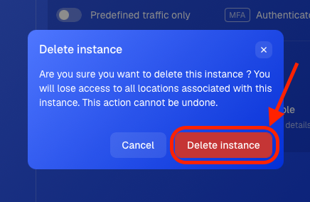</figure>

Your Instance will be removed immediately.
