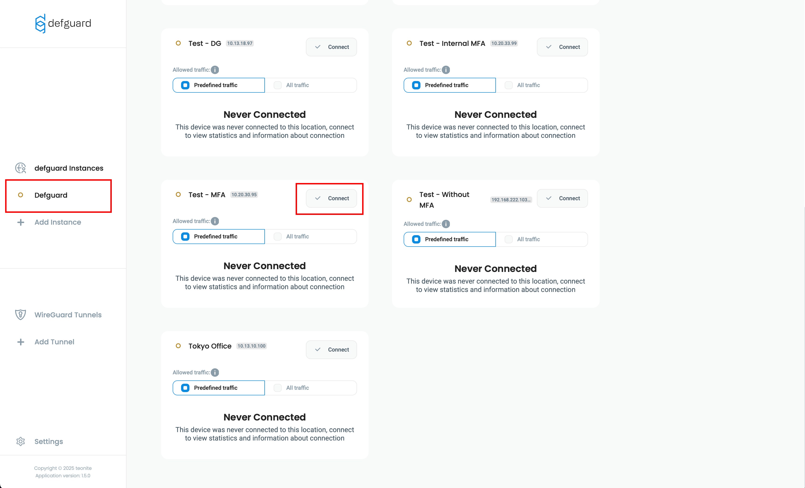
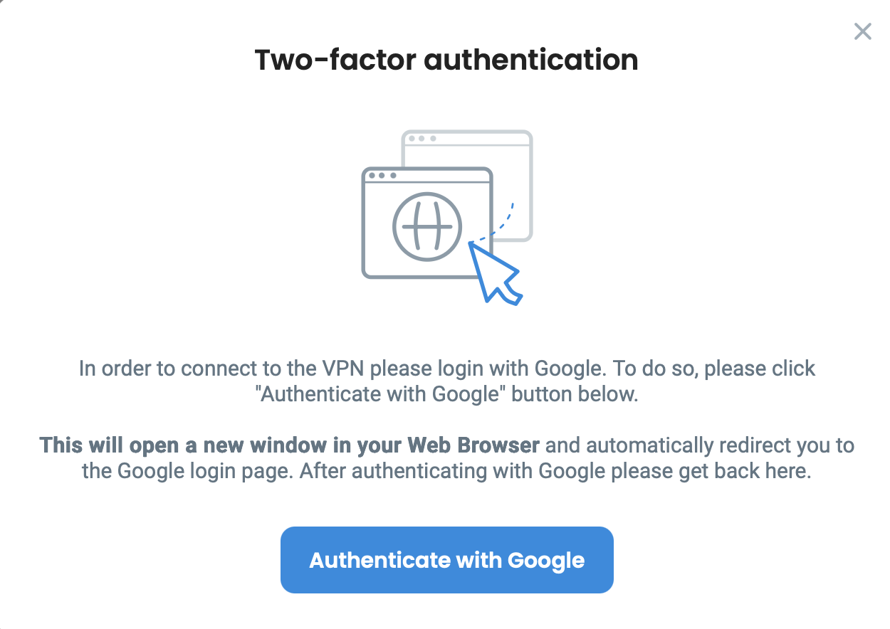
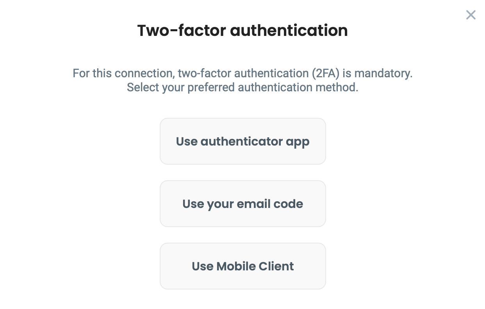
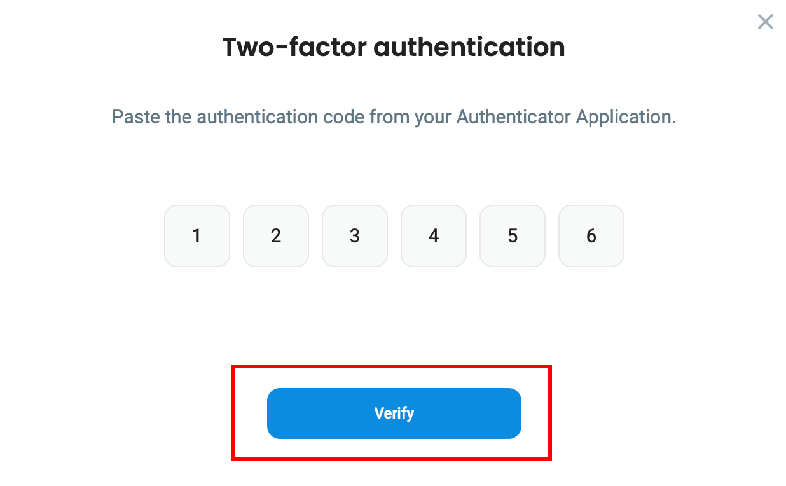
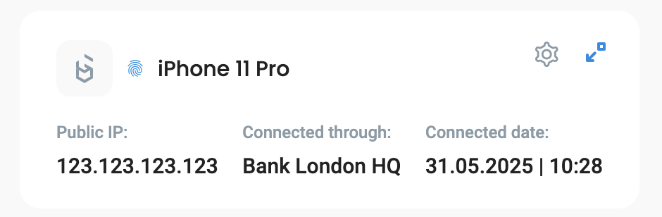

# Using Multi-Factor Authentication (MFA)

* Up to version 1.4, only internal MFA was supported, user could only use MFA methods configured in his profile.
* Since version 1.5 (currently in alpha), MFA can be configured per location, and administrators can choose whether a location will use internal MFA or external OIDC/SSO provider.

Depending on location settings, you may use:

* Internal MFA - You must have at least one MFA method configured in your profile. For a detailed tutorial, [check out this article](../setting-up-2fa-mfa.md).
* External MFA - You will be redirected to an external site, where authentication is handled by your OIDC provider, for example Google/Microsoft.

## External MFA

1. Open Defguard client, select your Instance and click **Connect** next to location with required MFA

<figure><figcaption></figcaption></figure>

2. After clicking **Authenticate with Google,** you will be redirected to a secure site where you will need to log in in order to confirm your identity. In this example, we use Google as our OpenID provider, but yours can be different (Microsoft, Okta, etc.)

<figure><figcaption></figcaption></figure>

3. After logging in, you will see this

<figure><figcaption></figcaption></figure>

Your connection will be established immediately after successful authentication.

## Internal MFA

1. Open Defguard client, select your Instance and click **Connect** next to location with required MFA

<figure><figcaption></figcaption></figure>

2. Choose method configured for your account, and click **Connect**.
   * If you're using "Email" method, please enter the code sent to your email.
   * If you're using "Authenticator App", please enter code generated within your authenticator app.


If you don't know how to set up or use your **Authenticator App,** please check [this article](../setting-up-2fa-mfa.md#setting-up-2famfa) for detailed information.


<figure><figcaption></figcaption></figure>


If you need a guide explaining how to use Mobile Client as your MFA method, please [scroll down.](using-multi-factor-authentication-mfa.md#authenticating-via-biometry)


3. After entering code, click **Verify**

<figure><figcaption></figcaption></figure>

Your connection will be established immediately after this step.

## Multi-Factor Authentication via Mobile Biometry

After configuring VPN on your mobile device and [enabling Biometry](../mobile-client/using-biometry-as-mfa-method.md#setting-up-biometry), we not only enable Biometry based connecting on a mobile device, but add an extra security layer to have the most secure/sophisticated MFA method available.&#x20;

After enabling Biometry we create an additional private/public key par, with the private key stored on the hardware/secure storage, and inform in the UI, that this device now can be used for MFA using Biometry on a desktop client:

<figure><figcaption></figcaption></figure>

Now, when you connect on the desktop client to a location that has Internal MFA configured, you can choose **“Mobile App”** for MFA, then a QR code will be shown.

<figure><figcaption></figcaption></figure>

This QR code to be scanned on the mobile device for additional MFA steps:&#x20;

1. &#x20;Biometry authentication, that enables access to device secure storage&#x20;
2. Additional validation with private/public key pair between mobile/desktop/core server. After that, our “normal” MFA flow (with session keys, WireGuard private/public keys) takes place.

Here is a video showcasing this process:


