# Using Multi-Factor Authentication (MFA)

MFA is configured per location, and administrators choose whether a location uses internal MFA or an external OIDC/SSO provider.

Depending on location settings, you may use:

* Internal MFA - You must have at least one MFA method configured in your profile. For a detailed tutorial, [check out this article](../setting-up-2fa-mfa.md).
* External MFA - You will be redirected to an external site, where authentication is handled by your OIDC provider, for example Google/Microsoft.

## External MFA

### Desktop client in tray view mode

1. Click **Connect VPN** on the location with the **OpenID** label

<figure>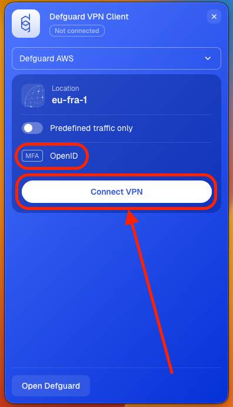<figcaption></figcaption></figure>

2. Click **Auth with OpenID**, you will be redirected to a secure site where you will need to log in in order to confirm your identity. (Google, Microsoft, Okta, etc.)

<figure>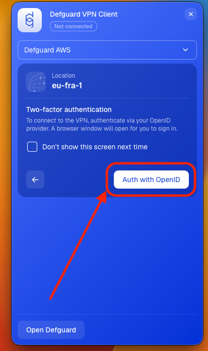<figcaption></figcaption></figure>

3. After confirming your identity (logging in) you will see the "Authentication Completed" message.

<figure>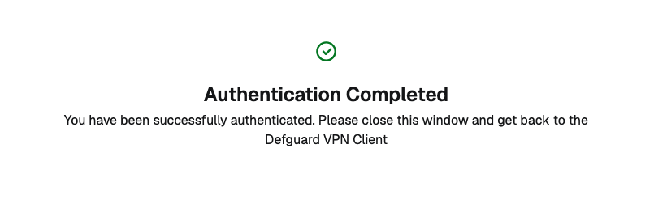<figcaption></figcaption></figure>

4. Now you can close this window and go back to the Defguard Client. Your connection will be established immediately.

<figure>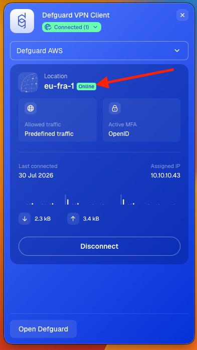<figcaption></figcaption></figure>

### Desktop client in full view mode

1. Click **Connect VPN** on the location with the **OpenID** label

<figure>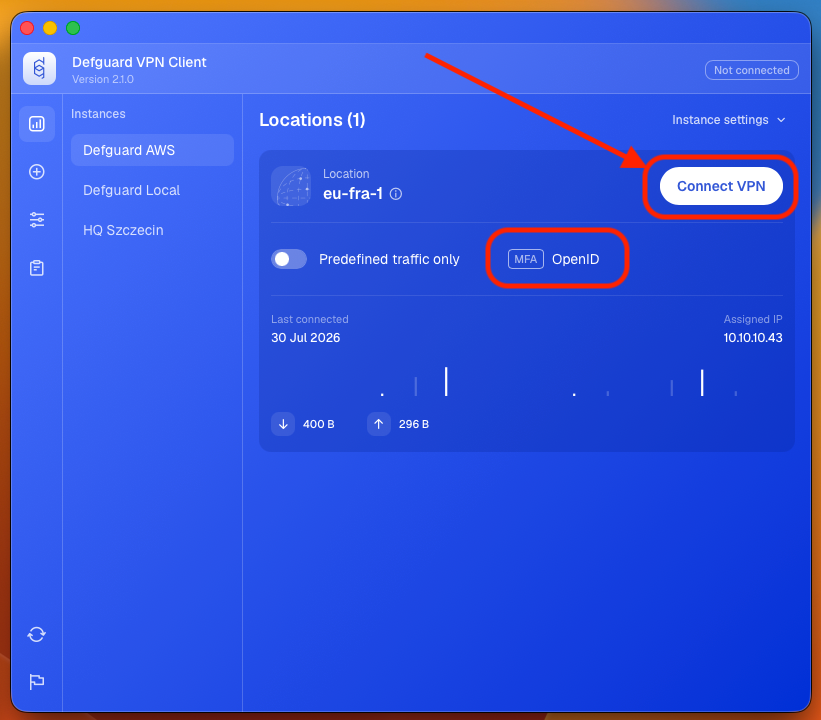<figcaption></figcaption></figure>

2. Click **Auth with OpenID**, you will be redirected to a secure site where you will need to log in in order to confirm your identity. (Google, Microsoft, Okta, etc.)

<figure>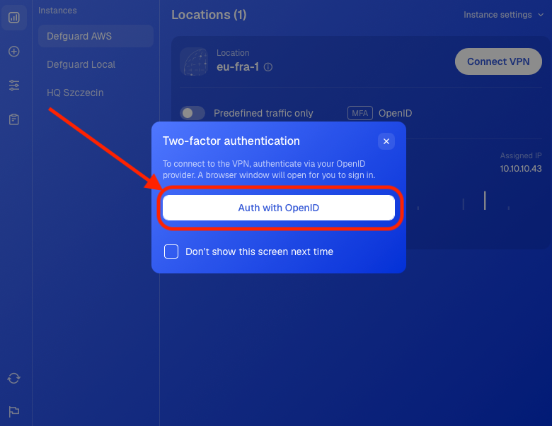<figcaption></figcaption></figure>

3. After confirming your identity (logging in) you will see the "Authentication Completed" message.

<figure><figcaption></figcaption></figure>

4. Now you can close this window and go back to the Defguard Client. Your connection will be established immediately.

<figure>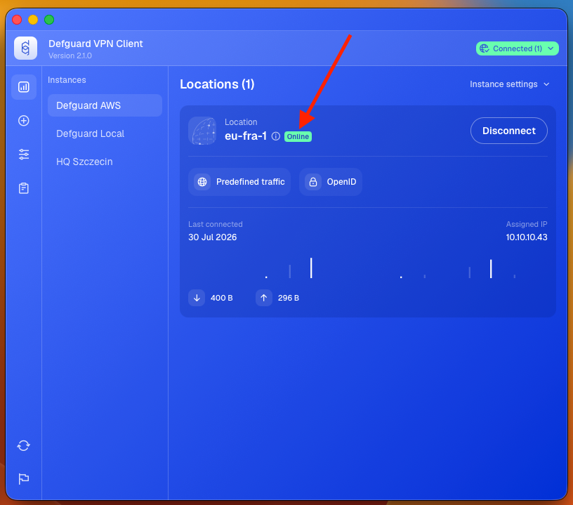<figcaption></figcaption></figure>

## Internal MFA

### Desktop client in tray view mode

1. If you are connecting to a location for the first time, click the pen icon on the right side of the panel. If not, skip to step 3.

<figure>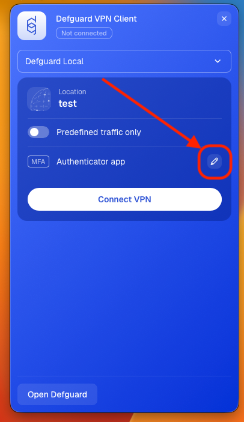</figure>

2. Choose the MFA method configured in your profile and click **Save changes**. If you haven't configured any of them, do it as described in [this guide](../setting-up-2fa-mfa.md#setting-up-2famfa).


If you need a guide explaining how to use Mobile Client as your MFA method, please [scroll down](using-multi-factor-authentication-mfa.md#multi-factor-authentication-via-mobile-biometry).


<figure>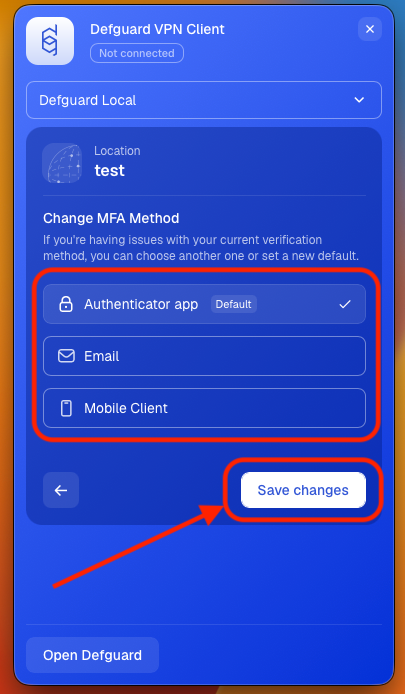</figure>

3. Click the **Connect VPN** button on the location.

<figure>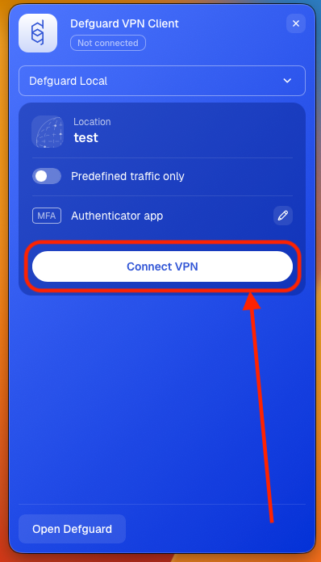</figure>

4. Enter the code from your Authenticator app or Email (depending on your choice in step 2) and click **Verify**.

<figure>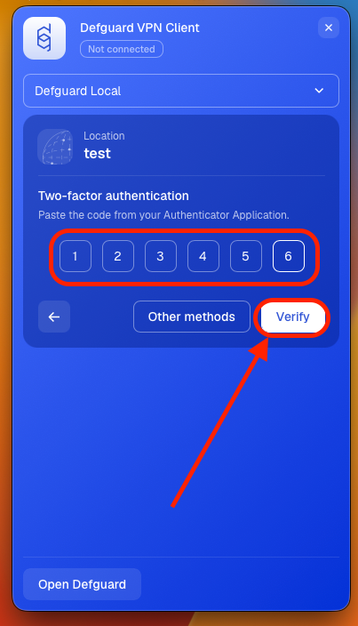</figure>

5. Your VPN connection will be established immediately.

<figure>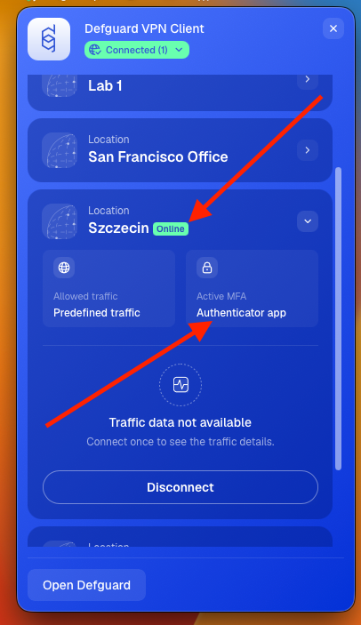</figure>

### Desktop client in full view mode

1. If you are connecting to a location for the first time, click the pen icon on the right side of the panel. If not, skip to step 3.

<figure>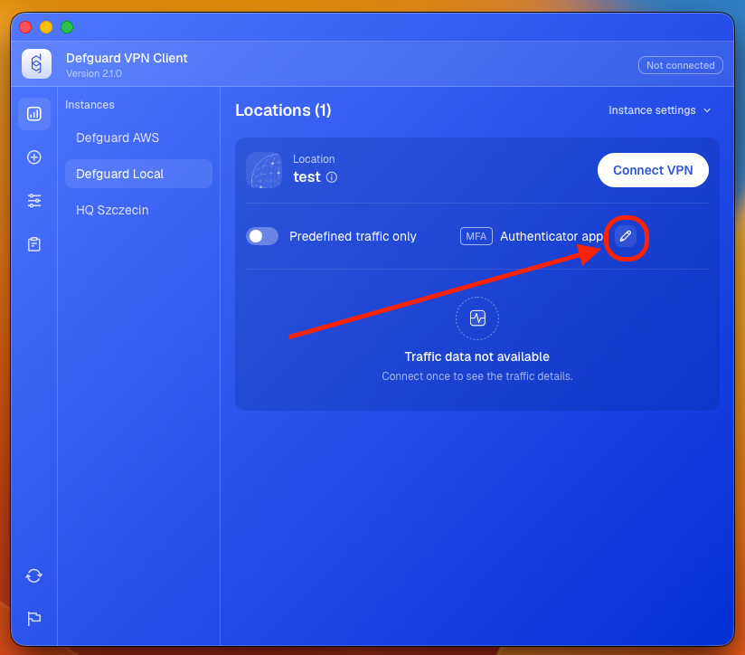</figure>

2. Choose the MFA method configured in your profile and click **Save changes**. If you haven't configured any of them, do it as described in [this guide](../setting-up-2fa-mfa.md#setting-up-2famfa).


If you need a guide explaining how to use Mobile Client as your MFA method, please [scroll down](using-multi-factor-authentication-mfa.md#multi-factor-authentication-via-mobile-biometry).


<figure>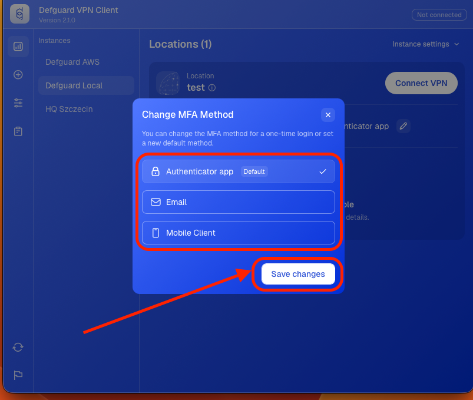</figure>

3. Click the **Connect VPN** button on the location.

<figure>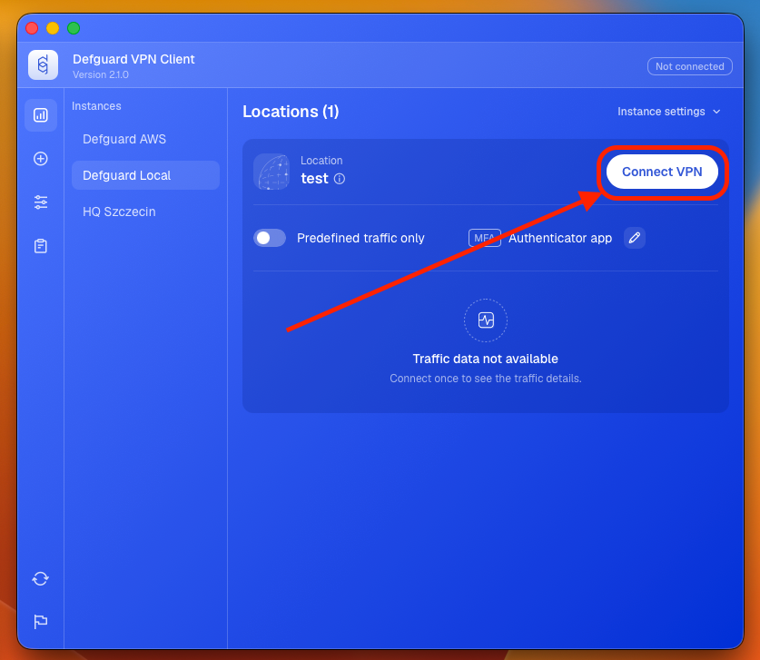</figure>

4. Enter the code from your Authenticator app or Email (depending on your choice in step 2) and click **Verify**.

<figure>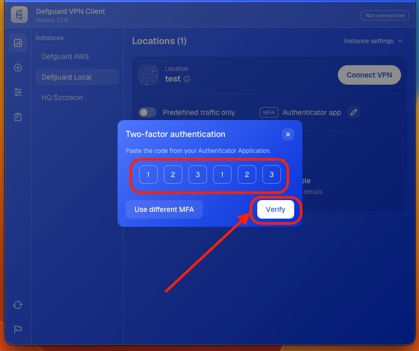</figure>

5. Your VPN connection will be established immediately.

<figure>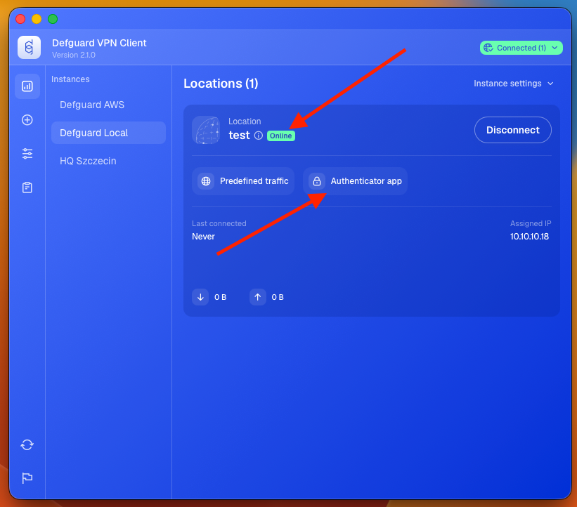</figure>

## Multi-Factor Authentication via Mobile Biometry

After configuring VPN on your mobile device and [enabling Biometry](../mobile-client/using-biometry-as-mfa-method.md#setting-up-biometry), we not only enable Biometry based connecting on a mobile device, but add an extra security layer to have the most secure/sophisticated MFA method available.

After enabling Biometry we create an additional private/public key pair, with the private key stored in hardware/secure storage, and indicate in the UI that this device can now be used for MFA using Biometry on a desktop client:

<figure><figcaption></figcaption></figure>

When you connect via desktop client to a location that has Internal MFA requirement, you can choose **“Mobile Client”** for MFA Method.

<figure>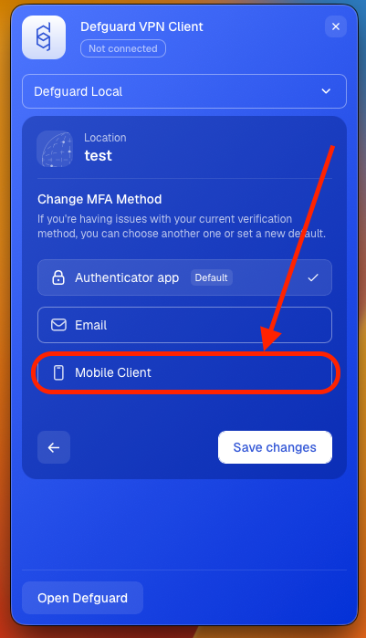</figure>

After selecting this method, before each connection you will see a QR code.

<figure>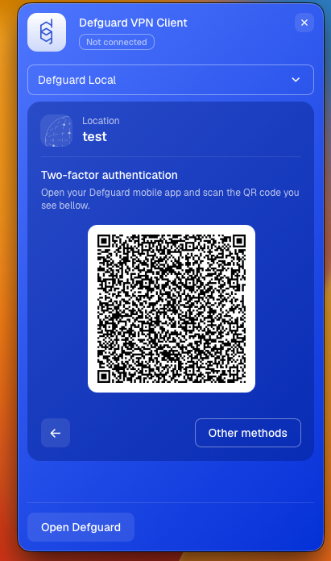<figcaption></figcaption></figure>

This QR code must be scanned on the mobile device for additional MFA steps:

1. Biometry authentication, that enables access to device secure storage
2. Additional validation with private/public key pair between mobile/desktop/core server. After that, our “normal” MFA flow (with session keys, WireGuard private/public keys) takes place.

Here is a video showcasing this process:



And here you can see the whole flow done with multiple steps including the user, desktop (and mobile) the Edge and Defguard Core and gateway in the final step:

<figure><figcaption></figcaption></figure>
