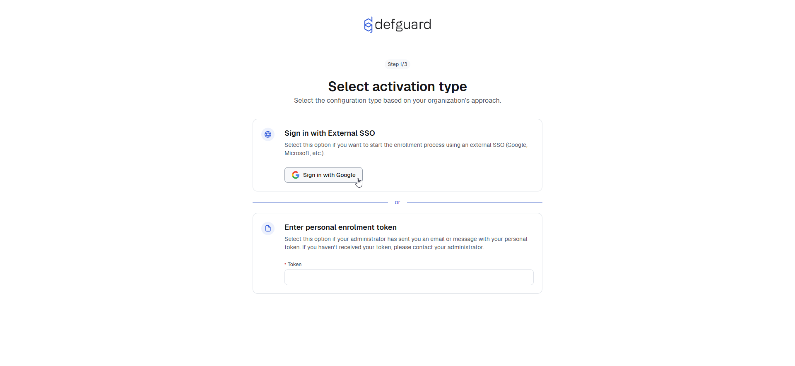

---
metaLinks:
  alternates:
    - >-
      https://app.gitbook.com/s/e86iamwJVSYnIRsyVEAV/using-defguard-for-end-users/enrollment/with-external-sso-google-microsoft-custom
---

# With external SSO (Google/Microsoft/Custom)

In this scenario, Defguard is only the VPN system and enrollment is used just to obtain credentials to configure the [Defguard Desktop Client](../desktop-client/).

Please go to the enrollment URL, like: https://enrollment.company.com and choose Enrollment:

<figure><figcaption></figcaption></figure>

Then all you have to do is click on your SSO login - the button name depends on the SSO you have configured:

<figure><figcaption></figcaption></figure>

Now log in with your SSO and after successful login process, you will receive information how to download and configure your client.

<figure><figcaption></figcaption></figure>

<figure><figcaption></figcaption></figure>
