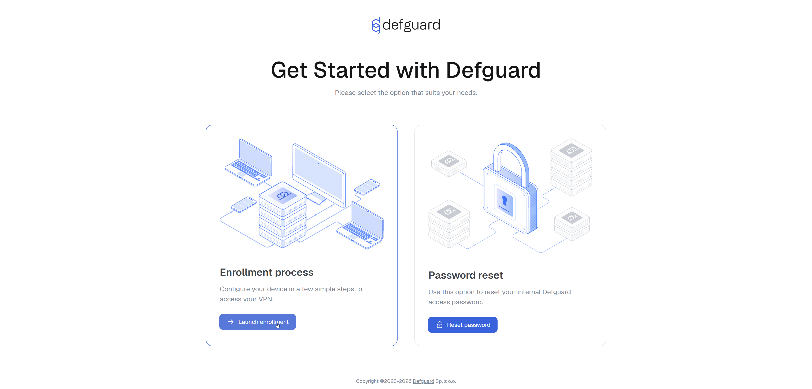
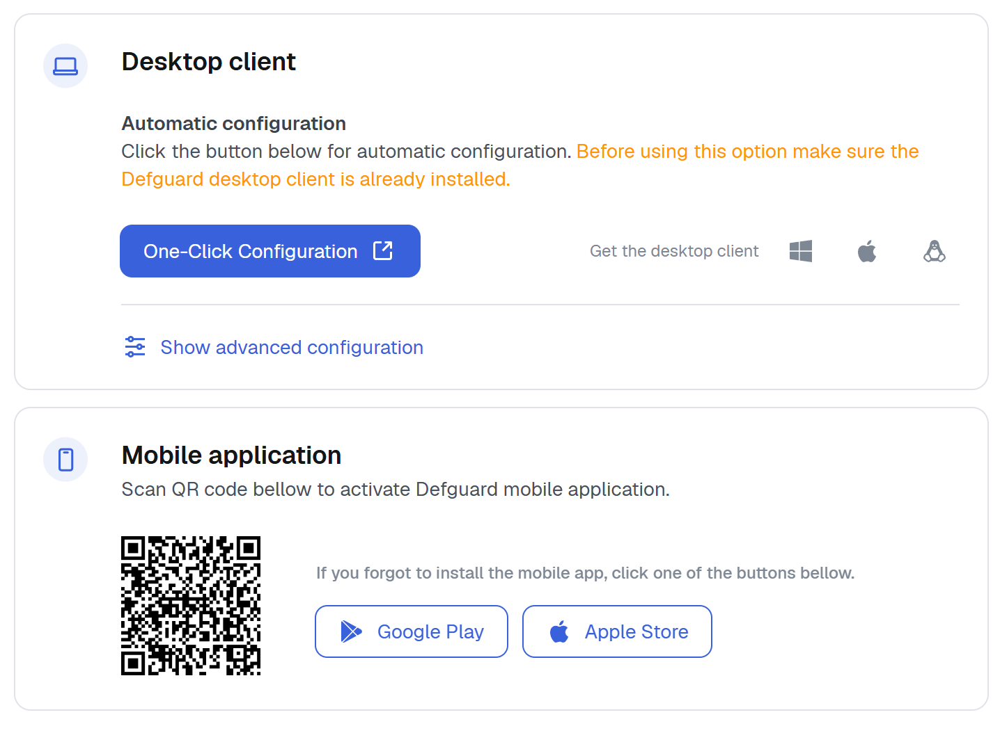
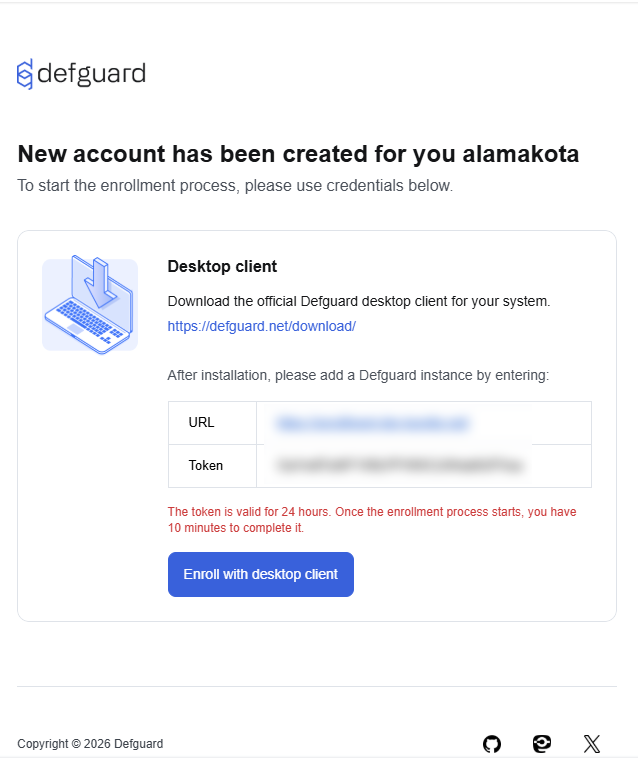

---
metaLinks:
  alternates:
    - >-
      https://app.gitbook.com/s/e86iamwJVSYnIRsyVEAV/using-defguard-for-end-users/mobile-client/instance-adding
---

# Adding new Instance

In this guide, you will learn how to add Instance in mobile app.

If you are after the enrollment process, please follow [this guide](instance-adding.md#adding-instance-in-defguard)

## Enrollment via external SSO

1.  Go to your enrollment page. Click **Select** under "Enrollment process". 

    <figure><figcaption></figcaption></figure>
2.  In this example we use Google as OIDC provider so our button is "Sign in with Google". Your organization can use different OIDC provider. 

    <figure><figcaption></figcaption></figure>
3.  You will be redirected to your OIDC provider login page, please log in. After doing this, you will be redirected and shown a screen with **URL, Token and QR Code**. 

    <figure><figcaption></figcaption></figure>
4. Open Defguard Mobile on your smartphone
5. Click **Scan QR Code**

<figure><figcaption></figcaption></figure>

6. Scan QR generated in step 3.
7. Enter the name of your device. For example "iPhone 11"
8. Confirm


If you can't scan QR Code, select **Add Instance Manually** in **step 5** and enter URL and Token from **step 3**.


## Enrollment via Email

Find enrollment **Instance URL** and **Token** in your "Defguard user enrollment" email. It should look like this:

<figure><figcaption></figcaption></figure>

Now proceed enrollment with your Client app.

## Adding Instance in Defguard

1. Log in to your Defguard account.
2. Go to **My Profile** tab.
3. Click **Add new device** button inside **User Devices** list.

<figure><figcaption></figcaption></figure>

4. Select **Remote Device Activation** and click **Next**.

<figure><figcaption></figcaption></figure>

5. After that you will see URL, Token and QR Code. **Take a screenshot of QR code**, we will need it in next step.

<figure><figcaption></figcaption></figure>

6. Open Defguard Mobile on your smartphone
7. Click **Scan QR Code**

<figure><figcaption></figcaption></figure>

8. Scan QR generated in step 5.
9. Enter the name of your device. For example "iPhone 11"
10. Confirm


If you can't scan QR Code, select **Add Instance Manually** in **step 4** and enter URL and Token from **step 5**.

