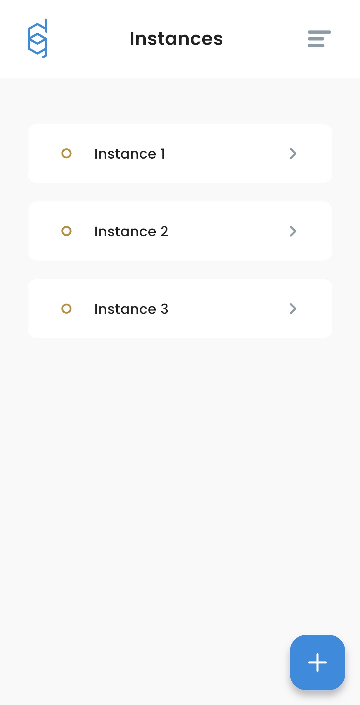
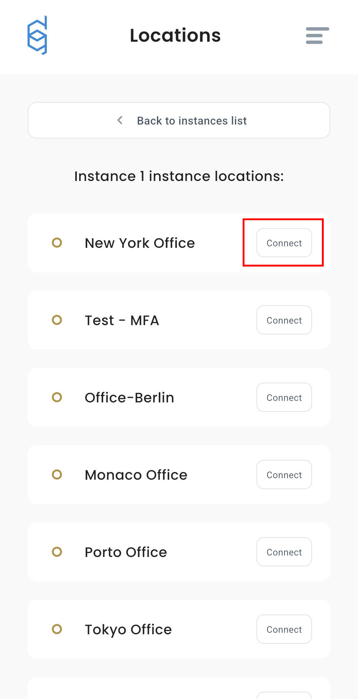
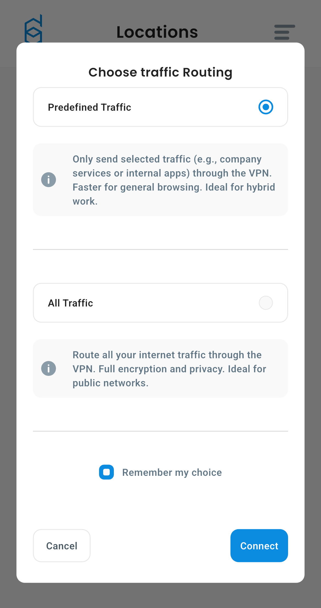
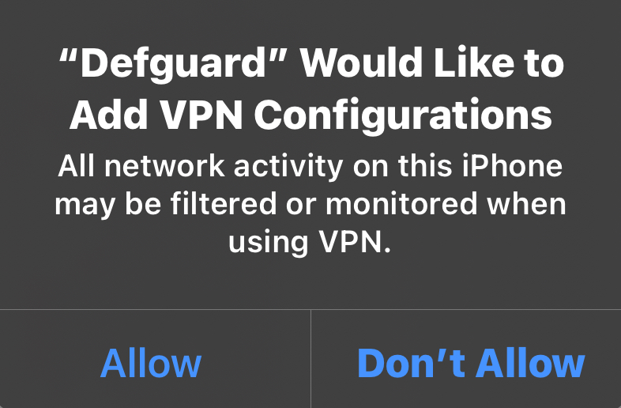
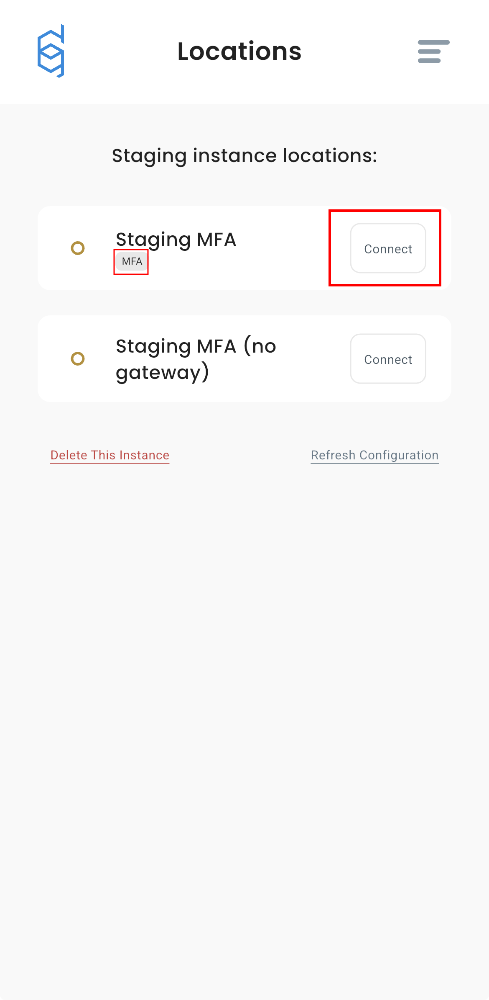
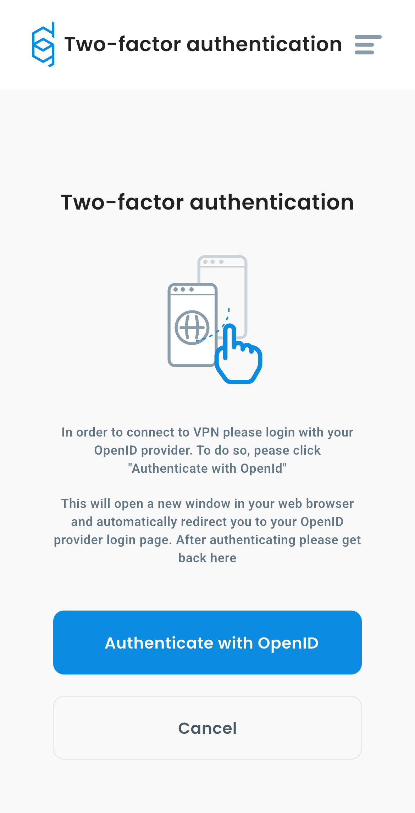
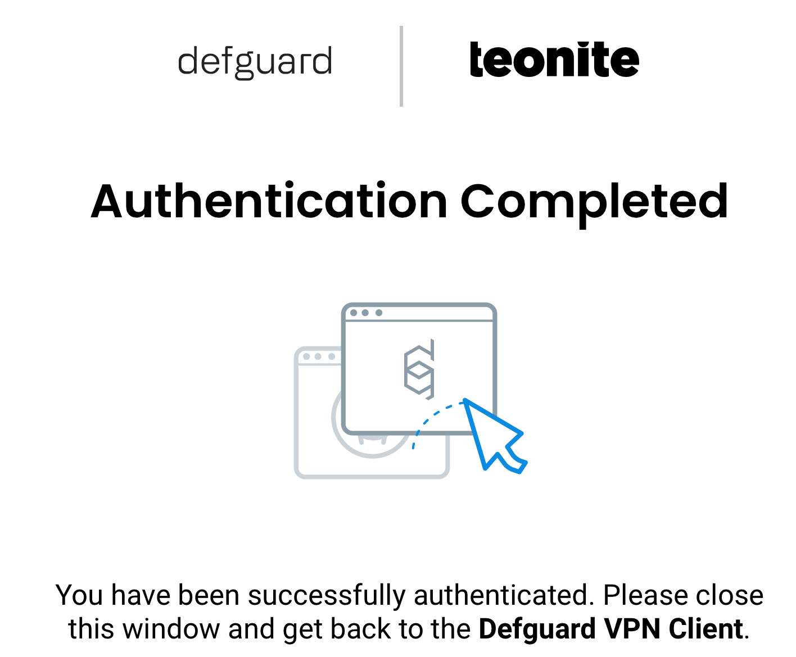
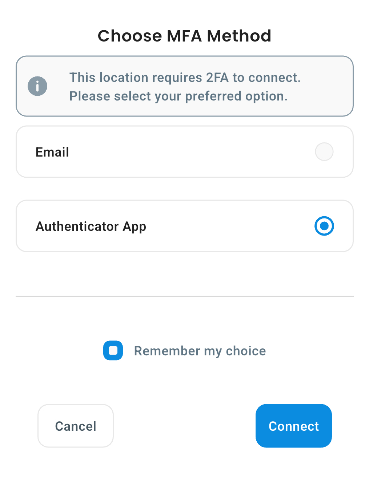
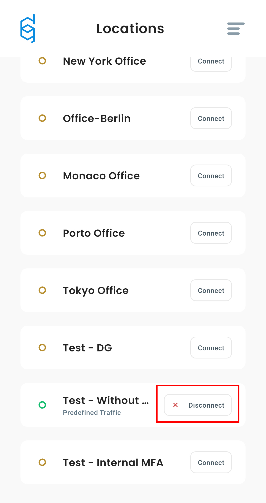

---
metaLinks:
  alternates:
    - >-
      https://app.gitbook.com/s/e86iamwJVSYnIRsyVEAV/using-defguard-for-end-users/mobile-client/instance-connect
---

# Connecting to Instance

In this guide, you will learn how to connect to location. If you haven't added an instance yet, follow [this guide](instance-adding.md#adding-instance-during-the-enrollment).

## Connecting to location without MFA

1. Open Defguard
2. Click on Instance you want to connect to.

<figure><figcaption></figcaption></figure>

3. Click **"Connect"** next to location you want to use.

<figure><figcaption></figcaption></figure>


The first time you connect, app will ask whether you want to route **predefined traffic** or **all traffic**. You will see screen like this:

* **Predefined traffic** will only route traffic specified by your administrator.
* **All traffic** will route everything through VPN tunnel.

You can select **Remember my choice** if you don't want to be asked again.

If you want to change your traffic routing method after your first connection go to [this article](instance-manage.md#changing-traffic-routing-method-after-first-connection)


4. Choose your routing method
5. Confirm


Your phone will need to add new VPN configuration, you will see popup like this:

Please click **Allow**, without this permission, Defguard cannot establish VPN connection.



If your location does not use MFA, your VPN connection should be established immediately after confirming your routing method.



Some VPN locations require extra security when connecting. This is called MFA (Multi-Factor Authentication). There are two types:

* Internal MFA: You confirm your identity directly in the app, for example by entering a code from your Authenticator App or email.
* External MFA: You are redirected to a secure login page (like Google or Microsoft) outside the app to confirm your identity.



If your location is using MFA please go to [section 3.2 "Connecting to location with MFA](instance-connect.md#connecting-to-location-with-mfa)


## Connecting to location with MFA

1. Open Defguard
2. Go to **Instances** and click **Connect** next to location you want to use.

<figure><figcaption></figcaption></figure>


The first time you connect, app will ask whether you want to route **predefined traffic** or **all traffic**. You will see screen like this:

* **Predefined traffic** will only route traffic specified by your administrator.
* **All traffic** will route everything through VPN tunnel.

You can select **Remember my choice** if you don't want to be asked again.

If you want to change your traffic routing method after your first connection go to [this article](instance-manage.md#changing-traffic-routing-method-after-first-connection)


3. Choose your routing method, and confirm.

Depending on your location settings you will need to authenticate with [external](instance-connect.md#external-mfa) or [internal](instance-connect.md#internal-mfa) MFA.

### External MFA

If the VPN location requires OpenID for authentication (external MFA) you will see screen like this:

<figure><figcaption></figcaption></figure>

Click **Authenticate with OpenID** and you will be redirected to a secure login page (for example Google/Microsoft). Follow the instructions on the screen to log in. After successful authentication please return to Defguard. In the app you will see screen like this:

<figure><figcaption></figcaption></figure>

After successful authentication, return to Defguard Mobile, your connection will be established automatically.

### Internal MFA


When connecting with MFA for the first time, you will have the option to select **Remember my choice**. Select this option if you want to always use this method for this location.


1. If you are connecting for first time, or if you have not clicked **Remember my choice** during previous connection, you will need to choose your MFA method.

<figure><figcaption></figcaption></figure>

2. Choose method configured for your account, and click **Connect**.
   * If you're using "Email" method, please enter code sent to your email.
   * If you're using "Authenticator App", please enter code generated within your authenticator app.


If you don't know how to setup or use your **Authenticator App** please check [this article](../setting-up-2fa-mfa.md#setting-up-2famfa) for detailed information.


3. After this step, your connection will be established immediately.

## Disconnecting from VPN

To disconnect from a VPN location in Defguard:

1. Open Defguard.
2. Go to the active instance
3. Click **Disconnect** button next to the location you are currently connected to.

<figure><figcaption></figcaption></figure>


After disconnecting, your device will stop sending traffic through the VPN and return to your regular internet connection.

