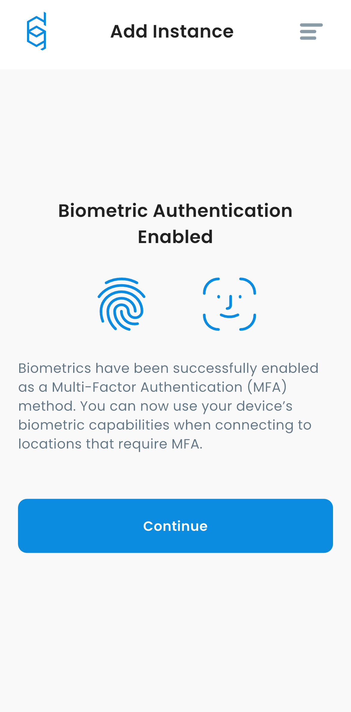
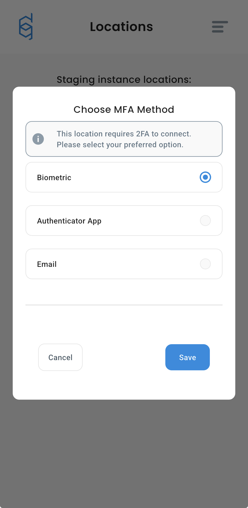

# Using Biometry as MFA method

In this guide, you will learn how to use biometry as MFA method when connecting to VPN location.

### Setting up Biometry


Biometry can be configured during adding Instance. If you skip this step, you will not be able to add biometry later, only removing and adding Instance again will trigger this modal.


1. First, start the process of adding a new Instance ([check this article](instance-adding.md#adding-instance-in-defguard)). You will see this screen.

<figure><figcaption></figcaption></figure>

2. Click **Yes**, after confirming your biometry method, you will see the following screen.

<figure><figcaption></figcaption></figure>

Biometry is now configured, and will be used as a primary MFA method. If you want to change your MFA method, please check [this guide](instance-manage.md#changing-mfa-method-after-first-connection), you will be able to use Biometry as your third MFA method.&#x20;

<figure><figcaption></figcaption></figure>

### Connecting to MFA location with biometry enabled

The whole process is the same as before, but instead of using TOTP/Email codes, you authenticate with biometry. For a detailed guide about connecting to Location, [check this article](instance-connect.md#connecting-to-location-with-mfa).

