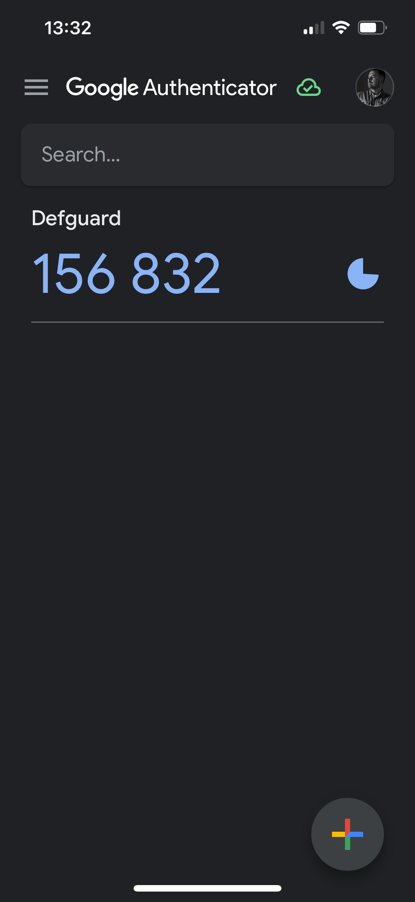

# Setting up 2FA/MFA

On account profile you will find all available 2FA options in **Details** tab, under **Two-factor methods**.

<figure><figcaption></figcaption></figure>

Choose which one you want to activate.


Whatever the method you will choose to configure next, please be prepared to do backup of your **Recovery backup codes** - as those are generated during the initial/first setup.


### Passkeys

Click on action button in Passkeys row.

<figure><figcaption></figcaption></figure>

Enter the name for the Passkey you will register for easy identification.


You can have multiple Passkeys for one account.


<figure><figcaption></figcaption></figure>

When you click **Submit** to create a passkey, your device’s operating system takes over to ensure your security data never leaves your hardware. Because of this, the setup process looks a bit different depending on the device you are using.


Stay in the Window: Do not close the system pop-up until it confirms the passkey is saved. Once finished, you will be automatically returned to the app.


#### Follow Your System Prompts

Once you click the button to create a passkey, a window from your device (e.g., Windows, macOS, Android, or iOS) will appear. Simply follow the instructions on that screen.

Depending on your device, you will usually be asked to:

* Scan your fingerprint (Touch ID or Android Fingerprint)
* Use facial recognition (Face ID or Windows Hello)
* Enter your device PIN or password
* Insert and tap a physical security key (like a YubiKey)


If you use a password manager (like 1Password or Bitwarden), your browser may ask if you want to save the passkey there instead of on your device. Either option is secure.


If this was the first 2FA method for the account then the system will ask you to save recovery codes [#backing-up-recovery-codes](setting-up-2fa-mfa.md#backing-up-recovery-codes "mention").

### Email

Click on action button in **Email** row.

<figure><figcaption></figcaption></figure>

After opening the dialog, check the email linked with the account to get the code. Enter it and click **Submit**.

<figure><figcaption></figcaption></figure>

That's it. If this was the first 2FA method for the account then the system will ask you to save recovery codes [#backing-up-recovery-codes](setting-up-2fa-mfa.md#backing-up-recovery-codes "mention").

### One time password

This method is based on time-based codes (TOTP), generated by an app.

Before you start to configure this step, you need to choose an app for generating your TOTP codes. Most popular are:

* [Google Authenticator for Android/iPhone/iPad](https://support.google.com/accounts/answer/1066447)
* [Bitwarden](https://bitwarden.com/help/authenticator-keys/) - which is a password manager which can help you to store/generate a secure password for your Defguard login but also setup TOTP

In this example, we will set up using Google Authenticator.

Click on action button on **Time-based One-Time Password** row.

<figure><figcaption></figcaption></figure>

A set up screen will show up with a QR Code:

<figure><figcaption></figcaption></figure>

Now open _Authenticator_ mobile app, and click: \_**Add a code → Scan a QR code and scan the QR Code with the app**.

After doing that, a new screen will show on the _Authenticator_ app, that will generate codes for Defguard:

<figure><figcaption></figcaption></figure>

**Enter the code you see on the mobile app**, to confirm, that the process has been done correctly (Defguard will now validate the code).

After the code has been validated, either:

* you are all set, the method is enabled, and you will be logged out to log in again using MFA
* or you [will need to create a backup of your recovery codes](setting-up-2fa-mfa.md#backing-up-recovery-codes) - and after that you will be logged out as well.

### Backing up recovery codes

If you are configuring the 2FA/MFA for the first time with any selected method, at the end of the process you will be asked to create a backup of your recovery codes:

<figure><figcaption></figcaption></figure>


Please backup those codes in a safe place, if you will not be able to login with your 2FA method (eg. you lost your phone or YubiKey hardware key) - the only method to login will be to use one of the **recovery codes.**

